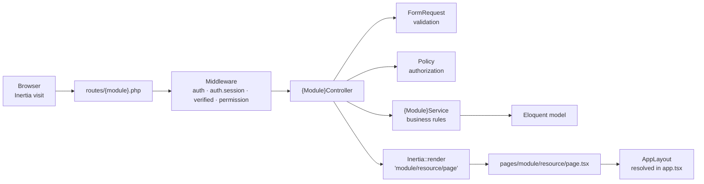

# Compozit Suite — Architecture Map

> **This file is the map of the repository.** It is the single source of truth for *where things
> live*, *what they are called*, and *which files you must touch* to add something.
>
> **Agents:** read this before planning or writing any code, and update it whenever you make a
> structural change. The sync contract lives in [`CLAUDE.md`](CLAUDE.md) and is restated in
> [§12 Keeping this file in sync](#12-keeping-this-file-in-sync). A `PostToolUse` hook enforces it.
>
> **Status:** volatile. The module list and directory layout will grow. Treat every ⬜ marker as a
> placeholder awaiting a decision, not as a settled design.

---

## 1. What this application is

Compozit Suite is a garments manufacturing ERP: buyer-scoped merchandising and production
management, built on a Laravel monolith with an Inertia + React front end. One deployable, one
database, five functional modules plus a dashboard.

---

## 2. Stack

| Layer | Technology | Version | Notes |
| --- | --- | --- | --- |
| Runtime | PHP | 8.4 (`^8.3` required) | `D:\Projects\laragon\bin\php\php-8.4.12-nts-Win32-vs17-x64` — not on the bash `PATH` |
| Framework | Laravel | `^13.17` | |
| Auth | Laravel Fortify | `^1.37` | Headless auth backend; routes registered by the package. **Login identifier is `employee_id`**, not email — see [§9.6](#96-authentication-identity) |
| RBAC | spatie/laravel-permission | `^8.3` | Published and wired, teams off — see [§9.1](#91-rbac-roles--permissions) |
| Adapter | Inertia.js (Laravel) | `^3.0` | v3 — no Axios, `Inertia::optional()` not `lazy()` |
| Typed routes | Laravel Wayfinder | `^0.1` | Generates TS from routes/controllers |
| UI | React | `19.2` | React Compiler enabled via Babel |
| Styling | Tailwind CSS + daisyUI | `4.x` / `5.x` | daisyUI supplies the theme tokens |
| Combobox | downshift | `^9.4` | Headless ARIA combobox behind `components/ui/combobox.tsx` — see [§8.5](#85-selects-are-comboboxes). The **only** third-party UI behaviour library; everything else is built on native elements + daisyUI |
| Build | Vite | `8.x` | |
| Tests | Pest | `^5.1` | |
| Browser tests | `pestphp/pest-plugin-browser` | `^5.0` | Drives a real Chromium. **Requires `ext-sockets`** (enabled in php.ini, like `ext-zip`) and the `playwright` npm package + `npx playwright install chromium`. Own config — see [§13.2](#132-a-dom-level-test-harness-exists--testsbrowser) |
| Static analysis | Larastan / PHPStan | `^3.9` | |
| Format | Pint (PHP), Prettier + ESLint (TS) | | |
| Doc parsing | `ext-zip` (PHP extension) | — | **Required.** `ZipArchive` reads a `.docx`; without it the whole purchase-order import fails. Enabled in `php.ini` — see [`documentation/deployment.md`](documentation/deployment.md) |
| Doc parsing | LibreOffice (`soffice`) | 26.8 | **External binary, optional.** Converts `.doc`/`.rtf` to `.docx`. Needed only for those two formats; `LIBREOFFICE_BIN` in `.env` |
| Doc parsing | Xpdf `pdftotext` | 4.06 | **External binary, optional.** `-layout` extraction for `.pdf`. Must be the **Xpdf** build, not Poppler — the parser reads column positions and the two differ. `PDFTOTEXT_BIN` in `.env` |
| Workbook parsing | `phpoffice/phpspreadsheet` | `^5.9` | Reads the BQS `.xlsx`/`.xls` import — see [§5 Module 3](#module-3--merchandising). In-process, no external binary. The **only** consumer is `Merchandising\BqsWorkbookReader`; nothing else may import from `PhpOffice\` |

The two external-binary rows are the application's only dependencies on software outside
Composer and npm. Each is needed by exactly one upload format, and each fails with a message
naming the `.env` key to set, so a machine without LibreOffice still imports `.docx` and `.pdf`
normally. Configuration is `config/po-parser.php` for purchase orders and
`config/bqs-import.php` for BQS workbooks.

> PhpSpreadsheet was added for the BQS import rather than hand-rolling an `ext-zip` reader.
> The owner chose it: a hand-rolled reader covers the one file in hand and not `.xls`, shared
> formulas, or the date and style edge cases a real Excel export produces. It is confined to one
> class so that decision stays reversible.

Database: **MySQL** (`compozitsuite` on `127.0.0.1:3306` via Laragon) for local development —
`.env` sets `DB_CONNECTION=mysql`. Tests run against in-memory SQLite (`phpunit.xml`) — *provided no
cached config is present*, which is a destructive trap and is now guarded; see
[§13.1](#131-never-run-the-suite-with-a-cached-config--and-it-can-no-longer-happen).

> This line previously said SQLite at `database/database.sqlite`; the disk disagreed, so the line
> was wrong. The split matters when writing migrations: InnoDB indexes foreign key columns
> automatically and SQLite does not, and `->change()` rebuilds the table on SQLite. Write migrations
> that are correct on both.

---

## 3. Top-level layout

```text
compozit-suite/
├── ARCHITECTURE.md          ← you are here; the repository map
├── CLAUDE.md                ← agent operating contract + sync rules + Boost guidelines
│
├── .claude/
│   ├── settings.json        Project hooks (committed)
│   └── hooks/
│       └── architecture-sync.mjs   PostToolUse hook enforcing §12
│
├── app/
│   ├── Actions/             Single-purpose invokable operations, grouped by module
│   │   └── Fortify/         Fortify's auth action contracts (not a module)
│   ├── Concerns/            Shared traits (validation rule sets, etc.)
│   ├── Console/Commands/    Artisan commands
│   ├── DataTransferObjects/ Immutable value objects, grouped by module — see §6.7
│   ├── Enums/               Backed enums, grouped by module
│   ├── Exceptions/          Custom exception types, grouped by module
│   ├── Http/
│   │   ├── Controllers/     Grouped by module
│   │   ├── Middleware/      App-wide middleware
│   │   └── Requests/        Form requests, grouped by module
│   ├── Models/              Eloquent models, grouped by module
│   │   └── Scopes/          Global query scopes — currently `BuyerScope`, see §9.2
│   ├── Observers/           Model observers — see §9.3
│   ├── Policies/            Authorization policies, grouped by module
│   ├── Providers/           Service providers
│   ├── Services/            Domain/business services, grouped by module
│   └── Support/             Framework-agnostic helpers with no module owner
│
├── bootstrap/
│   ├── app.php              Middleware stack, routing entry, exception handling
│   └── providers.php        Registered service providers
│
├── config/                  Laravel config
├── documentation/           Per-module reference docs — one `{module}.md` each; see §14
├── database/
│   ├── factories/           Grouped by module (mirrors app/Models/)
│   ├── migrations/          FLAT — chronological, never nested
│   └── seeders/             Grouped by module
│
├── resources/
│   ├── css/app.css          Tailwind + daisyUI entry
│   ├── js/
│   │   ├── actions/         GENERATED by Wayfinder — never edit
│   │   ├── routes/          GENERATED by Wayfinder — never edit
│   │   ├── components/      Grouped by module; `ui/` holds primitives
│   │   ├── hooks/           Shared React hooks
│   │   ├── layouts/         Page shells
│   │   ├── lib/             Client helpers (cn, themes)
│   │   ├── pages/           Inertia pages — path mirrors the URL
│   │   ├── types/           Shared TypeScript types
│   │   └── app.tsx          Client entry + layout resolver
│   └── views/app.blade.php  Inertia root template
│
├── routes/
│   ├── web.php              Entry point; requires every module route file
│   ├── settings.php         Module 2
│   ├── admin.php            Module 1
│   ├── merchandising.php    Module 3
│   ├── production.php       Module 4
│   ├── reports.php          Module 5
│   └── console.php          Scheduled/CLI routes
│
├── tests/
│   ├── Feature/             Grouped by module — the default place to write a test
│   │   └── Auth/            Fortify auth flows (not a module)
│   ├── Browser/             Real-browser tests — only what a DOM can answer; see §13.2
│   ├── Fixtures/            Binary sample documents the importers are proved against
│   └── Unit/                Pure logic only
│
├── phpunit.xml              The main suite — sqlite `:memory:`, never edited for browsers
└── phpunit.browser.xml      Browser suite only — sqlite file + real session driver (§13.2)
```

---

## 4. The organizing rule

**Layer first, module second.**

Laravel's standard top-level directories are kept intact, and each one is subdivided by module:

```text
app/Http/Controllers/Merchandising/TechPackController.php     ✅ this
app/Modules/Merchandising/Http/TechPackController.php         ❌ not this
```

Why this and not a `app/Modules/*` package-per-module layout:

- `php artisan make:*` targets it natively (`make:controller Merchandising/TechPackController`)
  with no custom generators, autoload entries, or per-module service providers.
- Wayfinder's generated output mirrors the PSR-4 path, so
  `App\Http\Controllers\Merchandising\TechPackController` becomes
  `@/actions/App/Http/Controllers/Merchandising/TechPackController` for free.
- Laravel's factory resolver maps `App\Models\Merchandising\TechPack` →
  `Database\Factories\Merchandising\TechPackFactory` automatically.
- Cross-module reads are common in this domain (a production order reads a merchandising PO), and
  hard package boundaries would create friction with no isolation benefit in a single deployable.

**Nesting depth is one level.** `app/Models/Merchandising/TechPack.php`, not
`app/Models/Merchandising/TechPack/TechPack.php`. Sub-areas within a module (tech packs, BQS,
bookings) are expressed through *file naming*, not deeper folders. Frontend pages are the one
exception — see [§6.4](#64-frontend-pages).

**An engine is one unit, and may nest.** `app/Services/Merchandising/PoParser/` is the sole
exception, and it is a deliberate one. The purchase-order document parser is 33 collaborating
classes forming a single pipeline — text extraction, line processing, a section state machine,
fifteen field extractors, validation — that nothing outside `PurchaseOrderImportService` calls
into. Flattening it produces `app/Services/Merchandising/PoParserLineItemHeaderExtractor.php`
thirty-three times, which does not remove the hierarchy, it just moves it into the filenames and
makes the directory listing unreadable.

The test for this exception, so it does not become a licence: **the nested tree has exactly one
entry point, and its internals are not referenced from outside it.** A sub-area with several
callers — tech packs, BQS, bookings — is a *sub-area* and stays flat, as above. If a second
engine ever qualifies, it earns its own line here.

---

## 5. Module registry

| # | Module | Namespace segment | Route file | Name prefix | URL prefix | Pages root | Status |
| --- | --- | --- | --- | --- | --- | --- | --- |
| 0 | Dashboard | `Dashboard` | `routes/web.php` | `dashboard` | `/dashboard` | `pages/dashboard.tsx` | ✅ built (placeholder content) |
| 1 | Admin | `Admin` | `routes/admin.php` | `admin.` | `/admin` | `pages/admin/` | 🟡 users + RBAC + designations built, rest scaffolded |
| 2 | Settings | `Settings` | `routes/settings.php` | *(see note)* | `/settings` | `pages/settings/` | ✅ partly built |
| 3 | Merchandising | `Merchandising` | `routes/merchandising.php` | `merchandising.` | `/merchandising` | `pages/merchandising/` | 🟡 purchase-order and BQS imports, TNA board and document library built; tech packs and bookings scaffolded |
| 4 | Production | `Production` | `routes/production.php` | `production.` | `/production` | `pages/production/` | 🟡 scaffolded |
| 5 | Reports | `Reports` | `routes/reports.php` | `reports.` | `/reports` | `pages/reports/` | 🟡 scaffolded |

Legend: ✅ built · 🟡 directories exist, no implementation · ⬜ planned, nothing exists.

> **Settings name-prefix note:** the existing account routes (`profile.edit`, `security.edit`,
> `appearance.edit`, `user-password.update`) are unprefixed because Fortify and the starter kit
> reference them by those names. **Do not rename them.** All *new* Settings routes use the
> `settings.` prefix — `settings.master-data.notification-colors.index` is the shipped example.

### Module 0 — Dashboard

Landing surface after login. KPI tiles and cross-module summaries.

| Concern | Path |
| --- | --- |
| Route | `routes/web.php` (inside the auth group) |
| Controller | `app/Http/Controllers/Dashboard/` 🟡 |
| Aggregation logic | `app/Services/Dashboard/` 🟡 |
| Page | `resources/js/pages/dashboard.tsx` ✅ |
| Widgets | `resources/js/components/shared/` |

Dashboard owns **no** models. It composes read-only data from other modules' services. If a
dashboard tile needs a query, that query belongs in the owning module's service.

### Module 1 — Admin

| Sub-area | Backend home | Pages | Status |
| --- | --- | --- | --- |
| a. User management | `Admin\UserController` | `pages/admin/users/` | ✅ |
| b. RBAC (roles & permissions) | `Admin\RoleController`, `Admin\PermissionController` | `pages/admin/roles/`, `pages/admin/permissions/` | ✅ |
| c. Buyer-wise user access control | `Admin\UserController::updateBuyerAccess`, `Admin\BuyerAccessService` | a dialog on `pages/admin/users/` | ✅ |
| d. Buyer setup & management | `Admin\BuyerController` | `pages/admin/buyers/` | ✅ |
| e. Audit logging | `Admin\AuditLogController` | `pages/admin/audit-logs/` | 🟡 |
| f. Designations (HR job titles) | `Admin\DesignationController` | `pages/admin/designations/` | ✅ |

Models live in `app/Models/Admin/` (`Role`, `Permission`, `Designation`, `Buyer`, `AuditLog`, …). `Role` and
`Permission` extend spatie's models so RBAC data is Admin-owned like everything else — see
[§9.1](#91-rbac-roles--permissions). `User` stays at `app/Models/User.php` — it is an
authentication concern shared by the whole app, not an Admin-owned model.

Both RBAC screens follow the module's standard path: resource routes (`show` excluded) gated
per-action by `permission:` middleware, a `{Model}Service` for the write path, form requests that
enforce the name formats, and `pages/admin/{roles,permissions}/{index,create,edit}.tsx`. Shared
form pieces live in `resources/js/components/admin/`.

**User management deliberately diverges from that page pattern.** It is a *single* page —
`pages/admin/users/index.tsx` — where create, edit, role assignment, password reset, soft delete,
restore and permanent delete all happen in modals, and where the active and historical (soft-deleted)
lists are two tabs driven by a `?view=active|trashed` query parameter rather than a second route.
It is also the module's **data-table reference**: sortable headers, a filter cell under each column,
a page-size selector and numbered pagination, all carried in the query string and validated by
`UserIndexRequest` against allow-lists on the model. Copy that shape for the next list surface.
This is a decision, not drift: the owner asked for one screen. Roles and permissions keep their
`index/create/edit` pages; do not "harmonise" one into the other without a new decision.

**Designations follow the user-management shape, not the RBAC one** — one page,
`pages/admin/designations/index.tsx`, with create, edit and delete in modals. A designation is a
*descriptive* HR job title: it grants nothing, and must never appear in an authorization check
(permissions do that — [§9.1](#91-rbac-roles--permissions)). It is retired by setting its `status`
to `I`, which removes it from the user form's picker; deleting it is a real delete and is **refused
by `Admin\DesignationService::deletionBlocker()` while any user — soft-deleted ones included —
still holds it**. Note the consequence: on this screen *deactivate* and *delete* are two different
verbs, unlike `users`, where the historical tab is `deleted_at`. The reasoning behind the `status`
char is in [`documentation/admin.md`](documentation/admin.md).

**Buyers follow the designation shape too** — one page, `pages/admin/buyers/index.tsx`, create/edit/
delete in modals, retired with `status` rather than soft-deleted. A buyer is the unit
[§9.2](#92-buyer-scoped-access-control) scopes every buyer-owned row by, so deleting one is refused
by `Admin\BuyerService::deletionBlocker()` once anything factual references it; access grants are not
facts and cascade.

**There is no buyer-access page.** Sub-area (c) was planned as `pages/admin/buyer-access/` with its
own controller; the owner decided a user's buyer access is edited where the user is — a dialog on
`admin/users`, beside the roles dialog, writing to `admin.users.buyer-access`. Two surfaces editing
one fact is how they drift, and the per-buyer question ("who can see Zara?") has no screen because
nothing asked it. `admin.buyer-access.view` gates whether the users list carries buyer data at all;
`admin.buyer-access.update` gates changing it. If a per-buyer screen is ever wanted, it reuses
`Admin\BuyerAccessService` rather than growing a second write path.

Every destructive action is confirmed through `components/admin/confirm-action-dialog.tsx` (built on
the existing `components/ui/dialog.tsx` — a native `<dialog>` styled with daisyUI — not a
third-party alert library) and reports its outcome through the shared `sonner` toast.

Admin is the only module allowed to write to roles, permissions, buyer-access assignments, and
audit log records.

### Module 2 — Settings

Two distinct halves, deliberately separated:

| Half | What it holds | Backend | Pages |
| --- | --- | --- | --- |
| Account settings | The signed-in user's own profile, security, appearance | `app/Http/Controllers/Settings/` ✅ | `pages/settings/{profile,security,appearance}.tsx` ✅ |
| Master data | Product/process reference tables: notification colors ✅, TNA templates ✅, then colors, sizes, UOM, seasons, fabric & trim types, machine types, process stages | `app/Http/Controllers/Settings/` 🟡 | `pages/settings/master-data/` 🟡 |
| App configuration | Optional app-level toggles and defaults | 🟡 | `pages/settings/application/` 🟡 |

Master data models go in `app/Models/Settings/`. Every other module *reads* them and none of them
write them — that write path belongs to Settings alone.

**The two halves no longer share a layout.** `SettingsLayout` is the account-settings shell and
nothing else; master data renders under plain `AppLayout` like the Admin lists. See
[§8.1](#81-layout-resolution--resourcesjsapptsx), which is where the rule was narrowed and why.

**Notification colours are the first master-data surface**, and they set the shape the rest follow:
one page with modals, `status` rather than `deleted_at`, the shared list apparatus, and the whole
`settings.master-data.*` permission bucket rather than a permission per table — so a second master
table adds no seeder entry and no role change. `documentation/settings.md` holds the reasoning.

**TNA templates are the second**, and they prove that claim: `tna_templates` added a route group to
the existing `settings/master-data` prefix and nothing else — no permission, no seeder entry, no
role change. A template is a lead-time band plus the milestone offsets and colour thresholds that
apply inside it; Merchandising reads it to draw the TNA page and never writes it. Its two child
tables (`tna_template_milestones`, `tna_template_colors`) are the first master data with children,
and they are written as a set rather than merged — see `documentation/settings.md`.

**`tna_template_colors` is also the first foreign key into `notification_colors`**, which retires
the note that used to stand here saying there was deliberately no deletion guard. There is one now:
`NotificationColorService::deletionBlocker()` refuses to delete a colour a template paints with, and
the FK is `restrictOnDelete` behind it. Any further reference into master data owes the same pair.

**Departments are not here.** HR/org-structure reference data (designations, departments) is
Admin-owned; only product and process reference data is Settings-owned. The split and its reason
are in [§9.4](#94-master-data).

### Module 3 — Merchandising

| Sub-area | Naming | Pages | Status |
| --- | --- | --- | --- |
| a. Development tech pack management | `Merchandising\TechPack*` | `pages/merchandising/tech-packs/` | 🟡 |
| b. BQS (the buyer's buy plan workbook) | `Merchandising\Bqs*` | `pages/merchandising/bqs/` | ✅ import + list + detail |
| c. Purchase order import & management | `Merchandising\PurchaseOrder*` | `pages/merchandising/purchase-orders/` | ✅ import + list + detail |
| d. Fabric & accessory booking | `Merchandising\Booking*` | `pages/merchandising/bookings/` | 🟡 |
| e. TNA (time & action schedule) | `Merchandising\Tna*` | `pages/merchandising/tna/` | ✅ read-only board |
| f. Document library | `Merchandising\Document*` | `pages/merchandising/documents/` | ✅ upload + list + detail |

Merchandising owns the order lifecycle up to the point production begins. It is the upstream
source of truth for style, buyer order, and consumption data that Production reads.

#### Purchase orders arrive by parsing a document

There is **no create form.** A purchase order is imported by uploading the buyer's own document
(`.docx`, `.doc`, `.rtf`, `.pdf`), which is parsed by the engine in
`app/Services/Merchandising/PoParser/` — the [§4](#4-the-organizing-rule) nesting exception. That is
why `import` is its own permission rather than an alias for `create`.

**The upload is a modal on the list page**, and there is no `GET` route for it — the standalone
import page it replaced was this application's last exception to "one page with modals". The list
controller therefore carries the dialog's two props, `importBuyers` and `pendingImport`, both gated
on the import permission so a read-only role pays for neither.

**An upload takes two requests when it collides.** A document holds up to fifty orders
(`po-parser.limits.max_pos_per_file`), and an order matching one already held is a question only a
person can answer — a genuine Walmart reissue and a re-uploaded stale document are identical to the
parser. Orders that collide with nothing are written immediately; the rest are **staged** on
`po_imports.staged_orders` and answered through `purchase-orders.import.resolve` with one of
**skip / revise / overwrite** per order. `overwrite` destroys the current revision and so requires
`merchandising.purchase-orders.delete` on top of `import`.

**The parser is specific to Walmart's import purchase-order template**, despite the general class
names. It recognises pages by a header of the form `Purchase Order: <10 digits> … Page: <n>` and
finds nothing in any other document. A second buyer's template is a second parser, not a wider
regex. The buyer is therefore chosen on the upload form rather than inferred, and is validated
against the uploader's own [§9.2](#92-buyer-scoped-access-control) access — importing into a buyer
you cannot see would write rows the scope then hides from you.

Three tables, and the split between them is the module's central decision:

| Table | Holds |
| --- | --- |
| `po_imports` | One row per uploaded file: the document, the whole parse result, every warning, and any orders still awaiting a decision |
| `purchase_orders` | One row per order per revision. Header fields are columns; the remaining ~10 sections ride in a `payload` JSON column |
| `po_line_items` | The colour/size lines — the only part of a document that becomes rows |

Line items are rows because Production computes consumption from quantity × colour × size and must
join to them; everything else is display-only and nothing queries it. Revisions are keyed on the
document's own `Revised Date … By:`, with a `source_hash` making a byte-identical re-upload
idempotent — nothing changed, so there is nothing to *ask* about. It is skipped without a
decision, but not without a word: `PurchaseOrderImportController::toastFor()` answers it with a
`warning` naming the orders ("Nothing imported — purchase orders … are already imported"), which
is a different branch from the staging one below. This line previously read "silently skipped",
and a reader could fairly have built it as no feedback at all. A revision is
now something the uploader **confirms**, not something the upload decides.
**Orders that fail to parse are stored and flagged**, so their warnings stay next to the
document — which means every downstream reader must exclude them, and `PurchaseOrder::scopeUsable()`
is how. The reasoning for all of this, and the trade-offs declined along the way, are in
[`documentation/merchandising.md`](documentation/merchandising.md).

#### A BQS is a workbook the buyer sends, not a quotation we prepare

> **This sub-area was previously described as a "budget quotation sheet".** That was wrong, and
> the line above is corrected rather than annotated. A BQS here is the buy plan George/Walmart
> sends: one row per vendor style per colourway, carrying store/ecomm/omni buy quantities, a cost
> stack, pack structure and month-by-month DC intake. Nothing in it is prepared by this company.

Like a purchase order, **there is no create form** — a BQS arrives as an `.xlsx`/`.xls` upload,
read by `Merchandising\BqsWorkbookReader`, and `import` is its own permission. The upload is a
modal on the list page, and the list controller carries the same two gated props,
`importBuyers` and `pendingImport`.

**The upload form asks for three things, and two are not in the file.** The buyer is chosen for
the [§9.2](#92-buyer-scoped-access-control) reason purchase orders are, and **`bqs_date` is
required master data entered by the uploader** — the workbook carries no date of any kind, so it
cannot be read and must not be guessed from a file timestamp.

Five tables, and the split is driven by one fact about the source:

| Table | Holds |
| --- | --- |
| `bqs_imports` | One row per uploaded workbook: the file, the resolved header map, every warning, and any BQS awaiting a decision |
| `bqs_sheets` | One row per BQS per revision. Buyer-owned; the thing the list lists |
| `bqs_rows` | One row per vendor style per colourway — 61 columns |
| `bqs_row_months` | The `In DC Units` band, one row per month |
| `bqs_row_pack_sizes` | The `Break Packs` / `Case Packs` bands, one row per size |

**28 of the workbook's 89 columns are data, not schema.** Eighteen are headed with month names
(`November-2026 … April-2028`) and ten with size labels (`XS(4/5) … XL(14/16)`); both sets change
with every season and size range. As columns they would need an `ALTER TABLE` per upload, so they
are child rows — which also keeps sizes joinable to `po_line_items`, where colour and size are
rows for the same reason. The remaining 61 are columns, named `{band}_{leaf}` because `Store`,
`Ecomm` and `OMNI` each appear six times in the leaf header and are ambiguous alone.

**Revisions are keyed on the rows, because the workbook has no key.** There is no document
number, no revision date, and a `Quote ID` column blank in every file received. So:

> Two uploads are the same BQS when their sets of `bqs_rows.row_key` **intersect**.

`row_key` is a hash of seven identity components — FYE, season, department, vendor style, pantone
colour, colour variant, item description — each also stored as an ordinary column. The collision
is answered **once per workbook** (skip / revise / overwrite), not once per row: a 200-row BQS
would otherwise produce a 200-decision dialog. A workbook overlapping *two* held revisions is
refused, being a revision of neither. `overwrite` destroys a revision and so requires
`merchandising.bqs.delete` on top of `import`, and `source_hash` makes a byte-identical
re-upload idempotent — skipped without a decision, and reported with a `warning` naming the
file, exactly as the purchase-order importer does above.

Revisions chain through `bqs_sheets.root_id`, a self-reference that revision 1 points at itself.
The file name cannot key them — a reissue routinely arrives under a different one — and leaving
`root_id` null on revision 1 would not bind the unique index, because both MySQL and SQLite
permit repeated NULLs in one.

**Header columns are matched by name, never by position**, so an inserted column cannot silently
shift 89 fields. A missing *required* column refuses the file by name; an unrecognised one is
imported with a warning. `Merchandising\BqsHeaderMap` owns that mapping and
`documentation/merchandising.md` records the rest.

#### A BQS row and a purchase-order line are the same garment, and are joined

A BQS row is what the buyer *planned*; a PO line is what they *ordered*. `po_line_items.bqs_row_id`
connects them, written only by `Merchandising\BqsPoLinker` — the single writer, so its rules hold
on every path rather than on the paths someone remembered.

**The match is strict equality on vendor style, colour family and Pantone colour, and that is a
decision with a measured cost.** A Walmart PO states colour as `{family}-{pantone}` in a
**15-character** column, so `BALLAD BLUE` arrives as `LTBLUE-BALLAD B` and `SANDSHELL` as
`NATURL-SANDSHEL`. On the reference documents only `PINK-CANDY PINK` auto-links; the other two go
to a person, permanently. The owner was shown this and confirmed the rule — **do not widen it to a
prefix match**, and note that `BqsPoLinkTest` pins both non-matches so that widening it fails
loudly. `Merchandising\BqsColourMatch` is the only place that colour string is parsed.

**A manual decision is stored as a rule, not as a fact about a line.** `bqs_colour_links` maps
(buyer, vendor style, PO colour) → BQS **row key**, so the next order carrying that colour resolves
with no second visit. That table exists *because* of strict equality; without it the same decision
would be re-made on every order forever. It is keyed on the row key rather than a row id so it
outlives revisions, and it is deliberately not a foreign key — the row it names may not be imported
yet.

Three further rules, each a decision:

- **Both import directions link.** `linkForPurchaseOrder()` and `linkForSheet()` both exist,
  because a PO routinely arrives before its BQS *and* after it. Wiring one leaves half the links
  unformed, invisibly.
- **Never across buyers.** Neither `po_line_items` nor `bqs_rows` carries a `buyer_id` — see
  [§9.2](#92-buyer-scoped-access-control) — so nothing in the database prevents a Walmart line
  pointing at a George row. The guard is the linker's queries plus `BqsLinkRequest`, and it is the
  only thing preventing it.
- **Ambiguity is refused.** Two current BQS rows matching one colour leaves the line unlinked, the
  same posture the importer takes for a workbook straddling two revisions.

**`po_line_items.quantity` is a pack ratio, not an ordered quantity**, and anything comparing an
order to a plan must know it. The five sizes of a colour read 3, 4, 4, 2, 1 — the fourteen of
"14PC GR SS SKATER DRESS" — and `total_cartons_per_line` says how many packs were ordered.
`PoLineItem::orderedUnits()` is the only thing that should do that multiplication; summing
`quantity` reports 14 where the answer is 5,502.

**Ordered is compared against the OMNI columns, split by PO type.** A purchase order counts as
initial or replenishment by matching `purchase_orders.po_type` to the codes the BQS row itself
states (`43 Import` / `42 Import Seasonal`), so nothing about Walmart's numbering is hard-coded.
The reference documents reconcile exactly:

```text
PO …001 (type 43)   5,502  = Initial Set Units / Store
PO …002 (type 43)     266  = Initial Set Units / Ecomm
                   -------
                    5,768  = Initial Set Units / OMNI
PO …003 (type 42)  21,868  = Replenishment Units / OMNI
```

Ecomm is ordered as its own purchase order, which is why the total is OMNI rather than Store —
against Store an exactly-complete initial buy reads 105%. **This was got wrong once**, by reading
a single pack's carton count as if it applied to the whole order; the counts in that document range
from 16 to 1,562. Do not reintroduce it.

#### TNA schedules are computed, never stored

The TNA board answers "is this order on schedule?" for every current, usable purchase order. It is
the proof-of-concept slice of `Master Order recap.xls`, which tracks ~25 milestone groups by hand.
`Merchandising\TnaCalculator` is the **only** place any of this arithmetic lives.

The chain, and it fails loudly at every link:

```text
purchase order → linked BQS rows → one BQS sheet → bqs_date
                              vendor_ship_date − bqs_date = lead time
                                    → the active tna_templates band covering it
                                          → bqs_date + each offset = the planned dates
```

**Lead time is `vendor_ship_date − bqs_date`**, which is the recap sheet's own formula (`=I4-D4`).
Shipment comes from the order, never from a template offset: it is the date lead time is measured
*to*, so scheduling it would let a template contradict the order it describes.
`TnaMilestone::offsetFromBqs()` is that distinction and the write requests enforce it.

**Templates match a lead-time *band*, not a lead time.** This is measured, not preference: the three
orders in the reference data run **263, 264 and 265 days** against one BQS, because ship dates are
staggered by a day each. An exact key matches none of them and needs a row per integer. Bands are
inclusive at both ends, may not overlap while active, and are checked in the form request because
neither MySQL nor SQLite can express range exclusion.

**No TNA table exists.** A plan is derived on every read, so correcting a template corrects every
order and there is nothing to backfill. The trade: **editing a template rewrites the past**, and a
schedule printed last week is not reproducible. That is right for a proof of concept; capturing
*actual* dates alongside the planned ones is what will force plans to be stored.

**Every failure names itself.** No BQS link, two BQS sheets behind one order, no ship date, a
non-positive lead time, no band covering it — each returns a `TnaPlanDto` carrying a `reason` the
page prints. Three blank cells and three blank cells with a sentence are the difference between "add
a band in Settings" and "link a colour on the order", and a reader cannot tell them apart otherwise.

#### The document library stores files and deliberately does not read them

The third upload surface, and the only one that is **not** an importer. A user picks a
`file_type` — BQS, Purchase order, Size chart, TNA formula, Other — attaches up to twenty files, and
that is the whole operation. `document_uploads` is the batch; `document_files` is one row per file.

**`file_type` is a label, not a pipeline, and this is the line a later reader will try to "fix".** A
batch typed `bqs` writes no `bqs_sheets` row, runs no reader, and is not an imported BQS. The two
existing importers are template-specific parsers that *refuse* what they cannot read; the library
exists for everything they refuse, which is most of what arrives. Wiring the two together would give
the application two write paths to one fact — the failure mode [§5 Module 1](#module-1--admin)
records for buyer access. The owner chose the separation knowing the cost: two places to put a
workbook, mitigated by naming rather than by mechanism.

Consequences worth stating, because each is a decision:

- **No parsing means no `import` permission.** The catalogue entry is
  `merchandising.documents.{view,create,update,delete}` — plain `create`, where BQS and purchase
  orders both have `import`. `import` names the power to run a parser over an upload; nothing here
  parses, so it would name a distinction that does not exist.
- **The index lists batches, the detail page lists files.** [§8.6](#86-every-list-is-paginated-sortable-and-filtered-per-column)
  forbids grouped rendering inside a paginated list, so the two cannot be one screen. `file_count`
  is a stored column, not a `withCount`, so the list can sort on it.
- **Replace destroys, and therefore needs `delete`.** There is no version chain. `update` alone
  would let a user who may add documents destroy one, which is the split `BqsResolveRequest`
  enforces for `overwrite`.
- **The batch cap is PHP's `max_file_uploads`, not a policy.** Files past it are dropped from
  `$_FILES` before any PHP runs — no warning, no validation error — so the form validates against it
  purely so the user is told. There is deliberately **no per-file size limit**: `upload_max_filesize`
  and `post_max_size` are the ceiling.
- **Nothing is previewed inline unless config allows it.** `svg` and `html` are absent from both
  allow-lists and must stay absent; an inline SVG served from this origin is stored XSS.
- **Every per-file route is nested under its batch and uses `->scopeBindings()`** — see
  [§9.2](#92-buyer-scoped-access-control), which is where the buyer question this surface raised is
  answered.

### Module 4 — Production

Garments production: cutting, sewing, finishing, packing, and the line/output tracking around
them. Sub-areas are not yet fixed — record them here as they are decided. ⬜

Production **reads** merchandising orders and master data; it does not modify them.

### Module 5 — Reports

Read-only, cross-module reporting.

Hard rule: **reports never write domain data and never contain business rules.** A report
controller calls report services in `app/Services/Reports/`, which compose queries. If a report
needs a calculation that a module already performs, call that module's service rather than
duplicating the arithmetic.

---

## 6. Naming conventions

### 6.1 Backend classes

| Kind | Location | Example |
| --- | --- | --- |
| Controller | `app/Http/Controllers/{Module}/` | `Merchandising\TechPackController` |
| Form request | `app/Http/Requests/{Module}/` | `Merchandising\TechPackStoreRequest` |
| Model | `app/Models/{Module}/` | `Merchandising\TechPack` |
| Policy | `app/Policies/{Module}/` | `Merchandising\TechPackPolicy` |
| Service | `app/Services/{Module}/` | `Merchandising\TechPackService` |
| Action | `app/Actions/{Module}/` | `Merchandising\DuplicateTechPack` |
| Enum | `app/Enums/{Module}/` | `Merchandising\TechPackStatus` |
| Factory | `database/factories/{Module}/` | `Merchandising\TechPackFactory` |
| Seeder | `database/seeders/{Module}/` | `Settings\ColorSeeder` |
| Feature test | `tests/Feature/{Module}/` | `Merchandising/TechPackTest.php` |

Request classes are named `{Model}{Action}Request` — `TechPackStoreRequest`,
`TechPackUpdateRequest`. Actions are named as verbs — `DuplicateTechPack`, not `TechPackDuplicator`.

An index screen's request is `{Model}IndexRequest` and extends `App\Http\Requests\ListRequest`
rather than `FormRequest` — see [§8.6](#86-every-list-is-paginated-sortable-and-filtered-per-column). That
base class is the one request that lives at the root of `app/Http/Requests/`, because it belongs to
no module.

Follow the PHP conventions in `CLAUDE.md`: explicit return types, promoted constructor properties,
curly braces always, PHPDoc over inline comments, `TitleCase` enum cases.

### 6.2 Routes

- URL segments: lowercase kebab-case — `/merchandising/tech-packs/{techPack}/edit`.
- Route names: dot-delimited, `{module}.{resource}.{action}` —
  `merchandising.tech-packs.index`.
- **There is no public landing page.** `/` is named `home` but renders nothing: it redirects
  authenticated users to `dashboard` and guests to `login`. The name is retained because the auth
  layouts and Wayfinder's generated `routes/index.ts` both depend on `home()` resolving. It is served
  by `App\Http\Controllers\HomeController` — the one controller at the root of
  `app/Http/Controllers/`, because `/` belongs to no module. It was an inline closure until it was
  made testable; that was a readability change, **not** a route-caching fix. Laravel 13 serializes
  closure routes through `SerializableClosure`
  (`Illuminate\Routing\Route::prepareForSerialization()`), so closures do not break `route:cache` —
  the `LogicException` older Laravel threw is gone. Prefer controllers anyway; do not record caching
  as the reason.
- Prefer resource routes; prefer `route()` and Wayfinder over hand-written URLs.
- Every module route file already applies `['auth', 'auth.session', 'verified']`. Add permission
  middleware per route or per sub-group, not globally.

### 6.3 Migrations

`database/migrations/` is **flat and chronological**. Laravel's migrator does not recurse into
subdirectories by default, so never nest them. Table names are snake_case plural and carry a
module hint where collision is plausible: `buyers`, `audit_logs`, `tech_packs`,
`purchase_orders`, `fabric_bookings`, `production_lines`.

#### Indexing

An index is not a property of a column, it is a property of a **query**. Find the query first.

- **Index what a query filters, joins or sorts on — nothing else.** An index that no `where`,
  `join` or `order by` touches is pure write cost: every insert and update maintains a B-tree that
  no select will ever read.
- **A `unique` constraint already *is* an index.** Never add a second one over the same column.
- **Don't index low-cardinality flags.** A boolean or a three-value enum is not selective enough to
  beat a scan. If such a column must be indexed, it belongs *inside a composite*, behind a
  selective leading column — never on its own.
- **Composites are ordered, and the order is the whole point.** `(deleted_at, name)` serves
  `where deleted_at … order by name`; `(name, deleted_at)` does not. Only an equality on the
  leading column lets the rest of the index supply sort order — a *range* on it (`is not null`,
  `>`, `between`) forces a filesort.
- **Foreign keys: InnoDB indexes them automatically, SQLite does not.** Development runs on MySQL
  and tests on SQLite ([§2](#2-stack)), so do not add an explicit index for a `constrained()`
  column — on MySQL it is a duplicate.
- **`LIKE '%term%'` cannot use a B-tree for the *predicate*,** ever — the leading wildcard defeats
  it. It can still use one for the `ORDER BY`, which is why `users_deleted_at_name_index` survived
  `name` becoming a contains filter: MySQL walks it in order, applies the wildcard as a residual
  filter, and stops at the `LIMIT`. So a contains column costs a scan, not the index. The
  alternatives remain prefix matching (`term%`, which an index *can* seek) or `FULLTEXT` — and if
  `FULLTEXT`, guard the migration by driver, because Laravel's SQLite grammar has no
  `compileFullText` and the migration will throw under test.
- **Choose contains-versus-prefix per column, and declare it.** Each model's `FILTERABLE` map names
  a `FilterType` for every filterable column ([§8.6](#86-every-list-is-paginated-sortable-and-filtered-per-column)).
  Names and emails are `Contains`, where finding mid-string is worth the scan; identifiers and phone
  numbers are `Prefix`, which is both how people type them and what keeps their indexes seekable.
  **Never infer this from the column type** — every filterable column in this application is a
  `varchar`, `employee_id` included, so inference would silently make everything `Contains`.
- **`OR` across several columns defeats indexing; `AND` does not.** One search box matching a term
  against six columns forces an unreliable index merge, or makes the optimizer pick one index and
  filter the rest — so indexes built for the other five are never used. A **filter row**, where each
  cell filters its own column and the cells are `AND`-ed, has no such problem: the leading predicate
  seeks and the rest are cheap residual filters. That is why the lists have a cell per column and
  not one box across all of them.
- **A `unique` index already serves `ORDER BY`,** not just lookups. With a `LIMIT`, MySQL walks it in
  order and stops early, so a `(deleted_at, that_column)` composite for sorting is usually redundant.
  Two such "obvious" composites were measured and rejected on `users`.
- **Selectivity decides whether an index gets used at all.** A prefix matching a seventh of the
  table will rightly be served by a scan; the same column with a selective prefix wins by 20×.
  Benchmark the query someone will actually run, not a broad one.
- **Verify with `EXPLAIN`; do not guess.** MySQL 8+/9 returns tree format. You want the index named
  in the plan, and `Covering index` where the query only needs indexed columns. A `Sort:` line above
  a range scan means the index is not supplying order.

Worked example, including what was deliberately *not* indexed and why:
[`documentation/admin.md` §2.1](documentation/admin.md).

### 6.4 Frontend pages

The Inertia page path **is** the file path under `resources/js/pages/`, lowercase kebab-case:

```php
Inertia::render('merchandising/tech-packs/index', [...]);
//               resources/js/pages/merchandising/tech-packs/index.tsx
```

Pages are the one place where nesting goes deeper than one level, because the path mirrors the URL.
Conventional file names within a resource directory: `index.tsx`, `create.tsx`, `edit.tsx`,
`show.tsx`.

### 6.5 Components

| Directory | Holds |
| --- | --- |
| `components/ui/` | Unstyled/low-level primitives (button, dialog, sidebar). Framework-level, no domain knowledge. |
| `components/shared/` | Cross-module composites used by two or more modules (data table, filter bar, page header). |
| `components/{module}/` | Components used by exactly one module. |

Promotion rule: a component starts in `components/{module}/`. The moment a **second** module
imports it, move it to `components/shared/` in the same change. Check for an existing component
before writing a new one.

**The list apparatus has been promoted, and it is the worked example.** `column-filter-row`,
`list-toolbar`, `pagination`, `sortable-header`, `confirm-action-dialog` and `confirm-delete-dialog`
all lived in `components/admin/` while Admin was the only module with a list. The Settings
master-data screen was the second importer, so all six moved to `components/shared/` in that change.
Both dialogs moved together even though only one was imported directly: `confirm-delete-dialog` is a
thin preset over `confirm-action-dialog`, and promoting the wrapper alone would have left a shared
component importing out of `components/admin/` — which is the coupling the rule exists to remove.
The `*-form-dialog.tsx` files stayed put; they know their module's fields and have one caller each.

File names are kebab-case; the exported component is PascalCase.

### 6.6 TypeScript types

Shared, app-wide types live in `resources/js/types/` and are re-exported from
`types/index.ts`. Module domain types go in `resources/js/types/{module}.ts` and must also be
re-exported there so `@/types` stays the single import path.

### 6.7 Data transfer objects and exceptions

Two `app/` directories were added with the purchase-order import, both grouped by module like every
other layer:

| Kind | Location | Example |
| --- | --- | --- |
| DTO | `app/DataTransferObjects/{Module}/` | `Merchandising\Po\PurchaseOrderDto` |
| Exception | `app/Exceptions/{Module}/` | `Merchandising\PoParser\TextExtractionException` |

**A DTO is `final readonly` with promoted typed properties, and carries a `toArray()`.** They exist
where data crosses a boundary in a shape no Eloquent model has — here, what a parser read out of a
document before anything decides which parts become columns. They are not a general replacement for
arrays: a service returning `['id' => …, 'name' => …]` to its own controller does not need one.

`toArray()` keys are snake_case and are a **contract in two directions** wherever a DTO is stored:
`PurchaseOrderDto::toArray()` is both the `purchase_orders.payload` column and the prop the React
page renders, so changing a key is a migration *and* a front-end change.

An exception type earns its place when a caller catches it *specifically*. The parser's four form a
hierarchy under one base so that "this document could not be read" is one `catch`, which is what
the import controller does.

---

## 7. Request lifecycle



Where logic belongs, in order of preference:

1. **Form request** — validation and authorization gate.
2. **Policy** — per-record authorization.
3. **Service** — anything with more than one step, or touching more than one model.
4. **Action** — one discrete operation with a single caller.
5. **Controller** — orchestration only. A controller method that exceeds ~20 lines is a service
   waiting to be extracted.

Models hold relationships, casts, scopes, and accessors. They do not hold workflow.

---

## 8. Frontend wiring

### 8.1 Layout resolution — `resources/js/app.tsx`

Layouts are assigned centrally by page-name prefix, not per page:

| Page name matches | Layout |
| --- | --- |
| `auth/*` | `AuthLayout` |
| exactly `settings/profile`, `settings/security`, `settings/appearance` | `[AppLayout, SettingsLayout]` |
| everything else — **including the rest of `settings/`** | `AppLayout` |

**New modules need no change here** — they fall through to `AppLayout`. Only edit `app.tsx` if a
module needs its own sub-layout, and record that decision in this file.

**This rule previously read `settings/*` → `[AppLayout, SettingsLayout]`, and that was wrong.** It
conflated a URL prefix with a layout. `SettingsLayout` is not a Settings shell; it is the *account
settings* shell — a fixed three-item nav (Profile, Security, Appearance), a heading that says
"Manage your profile and account settings", and a `max-w-xl` content column sized for a short form.
The first master-data screen is a paginated table with a filter row, and it cannot render in that
column at all. The three account pages are therefore named explicitly, in a
`ACCOUNT_SETTINGS_PAGES` array, and everything else under `settings/` falls through to `AppLayout`
and looks like the Admin lists it is a sibling of.

Two consequences worth keeping in mind:

- **The match is exact, not a prefix.** A fourth account page has to be added to that array — which
  is the intent: joining the account shell should be a decision, not something a filename does by
  accident.
- **`SettingsLayout` itself was left untouched.** Teaching it a second nav section and a conditional
  width was the alternative, and it makes one component serve two unrelated jobs that every future
  master table then edits. Narrowing the resolver is the smaller and more reversible half.

### 8.2 Wayfinder — generated, never edited

`resources/js/actions/` and `resources/js/routes/` are generated by the Wayfinder Vite plugin.

- Never hand-edit them, and never hand-write a URL string in a page.
- **`.prettierignore` excludes all three generated paths** — `actions/`, `routes/` and the
  `wayfinder/` runtime — because `npm run format` formats all of `resources/` and would otherwise
  rewrite ~9,200 lines across 68 generated files that the next `wayfinder:generate` writes straight
  back unformatted. The tree then flips between two states depending on which command ran last,
  which is diff noise and a standing merge conflict. This was found by running the two prescribed
  commands in the order [§10](#10-adding-a-feature-to-an-existing-module) prescribes them.
- Import controller actions from `@/actions/...` and named routes from `@/routes/...`.
- They regenerate on `npm run dev` / `npm run build`, or via
  **`php artisan wayfinder:generate --with-form`**.
- After adding routes, regenerate before writing the page that links to them.
- **`--with-form` is not optional.** `vite.config.ts` configures the plugin with
  `formVariants: true`, and every `<Form {...submit}>` in this application is built on the
  `.form()` variant that flag emits. Running the bare command regenerates the same files *without*
  those variants — roughly 3,500 lines vanish, and `npm run types:check` then fails across pages
  nobody touched. This line previously omitted the flag and that is exactly what happened; if a
  routine `types:check` suddenly reports `Property 'form' does not exist` in `auth/login.tsx`, this
  is the cause, and the fix is to regenerate with the flag rather than to change any page.

### 8.3 Navigation

The sidebar is defined in `resources/js/components/app-sidebar.tsx`. Adding a module surface means
adding an entry there — see the checklist in [§11](#11-adding-a-new-module).

**Nav items are grouped by module.** `<NavMain>` renders one labelled group; the sidebar composes
one per module — `mainNavItems` under the default "Platform" label, `adminNavItems` under "Admin",
and so on as modules land. A module's links never join another module's group. A group whose items
are all hidden is not rendered at all.

**Every group collapses, and the state is remembered.** With five modules landing, five
permanently-expanded blocks is not a sidebar anyone can use. The `SidebarGroupLabel` is the toggle;
the links stay flat and top-level. Rules that come with it:

- **The label toggles, it does not become a parent row.** `SidebarMenuSub` /
  `SidebarMenuSubButton` exist in `sidebar.tsx` and are deliberately **unused** — the indented-
  submenu shape was considered and declined, because in the icon rail those parts are
  `display: none` and a module would become an icon that leads nowhere.
- **The icon rail always renders groups expanded.** `SidebarGroupLabel` is `opacity-0
  pointer-events-none` at 3rem, so a collapsed group there would hide its icons with no reachable
  way to bring them back. `NavMain` overrides the stored state whenever `useSidebar().state` is
  `collapsed` and the viewport is not mobile.
- **Collapsed groups live in the `sidebar_groups` cookie**, comma-joined labels, read by
  `HandleInertiaRequests` into the `collapsedNavGroups` prop — the same treatment `sidebar_state`
  gets, and for the same reason: read server-side, the sidebar is correct on first paint.
  `localStorage` was declined for the flash of wrong state on every load. The cookie is in
  `encryptCookies(except:)`; without that the browser's value is discarded as tampered and the
  preference silently never persists.
- **Navigating into a collapsed group opens it, and that counts as opening it** — the label is
  removed from the cookie, not merely overridden for one render. One invariant, rather than a
  precedence puzzle between what the cookie says and where the user is. Note that `AppLayout`
  persists across Inertia visits, so `NavMain` does *not* remount: seeding this at mount is not
  enough, it has to react to the URL changing.
- **`useNavGroups` is called once**, in `app-sidebar.tsx`, which is the only place that knows every
  group and its items; `NavMain` is presentational and takes `expanded` / `onToggle`. Two hook
  instances would each hold half the collapsed set and overwrite each other's cookie.
- Group identity is the **label string**. Renaming a group orphans its cookie entry, which reads as
  the group being expanded once — harmless, and the stale entry is dropped on the next write.

Entries for permission-gated surfaces are appended conditionally with `useCan()` (see
[§9.1](#91-rbac-roles--permissions)), so a user never sees a link they cannot open. That is
presentation only — the route's `permission:` middleware is what actually denies access.

### 8.4 Inertia v3 notes

- **No Axios.** Use the built-in XHR client or the `useHttp` hook.
- `useHttp` owns *form state* — data, errors, `processing`. For a plain JSON **read** that has no
  form behind it (a live availability check, a typeahead), use `fetch` with an `AbortController`
  instead: `useHttp` returns a new object every render, so driving it from an effect means either
  a ref written during render or a dependency loop, both of which the React Compiler lint rules
  reject. `hooks/use-availability.ts` is the reference implementation. This is not licence to reach
  for Axios — the ban stands.
- `Inertia::optional()` — `Inertia::lazy()` / `LazyProp` are removed.
- Deferred props must render a pulsing skeleton as their empty state.
- Event renames: `invalid` → `httpException`, `exception` → `networkError`;
  `router.cancel()` → `router.cancelAll()`.

### 8.5 Selects are comboboxes

**There are no native `<select>` elements in this application.** Every one is
`components/ui/combobox.tsx`, a searchable listbox built on `downshift`.

- **One component, not two idioms.** It renders a plain listbox below
  `SEARCH_THRESHOLD` (10) options and reveals the search input above it, so a three-option Gender
  select stays one click while a long designation list is typeable. Call sites never choose.
- **It submits through a hidden `<input>`.** Every form here is an uncontrolled
  `<Form {...submit}>` reading `name=` off native elements; a `<div role="combobox">` submits
  nothing. Any new control that replaces a native form element must do the same.
- **`multiple` renders removable chips** and emits one hidden `name[]` input per selection, so the
  server sees exactly what a checkbox list would have sent.
- **Option values match by value, not by identity.** The same id reaches the control as a number
  from the server (`assignableOptions()` and every `options` endpoint emit an `int` `value`) and,
  from a call site that seeded `defaultValue` out of form-shaped state, as a string. `===` reads
  those as different: the trigger falls back to its placeholder while the hidden input goes on
  submitting the right id, which looks like data loss and is not. `combobox.tsx` therefore compares
  through `sameValue()`, which normalises to a string and treats `null`/`undefined` as matching
  nothing. The TNA template colour ladder shipped with this bug. Call sites should still pass ids
  in the type the server uses; the normalisation is a floor, not a licence.
- **The hidden-input contract binds every compound control, not just this one.**
  `components/ui/color-input.tsx` is the second: a native `<input type="color">` for picking and a
  text `<Input>` for typing the same hex, of which **only the text field carries `name`** — the
  colour swatch is an unnamed visual control that writes into it. Two named inputs would submit the
  field twice and the last one would win, which is a bug that looks like nothing until the values
  disagree. Any further control built from more than one element does the same.
- **Why a dependency at all**, when `dropdown-menu.tsx` deliberately replaced Radix by hand: that
  file's docblock states the rule — hand-roll the simple primitive, buy the complicated one.
  `aria-activedescendant`, roving virtual focus and filtered-result announcements are the
  complicated one. downshift is headless, so every class name is still ours.
- Placement for both is `lib/anchored-position.ts`.

#### Options endpoints — the async source

A combobox given `searchUrl` fetches its options per keystroke instead of filtering locally. Use it
when a list outgrows being shipped to the browser whole. The convention:

```php
Route::get('{resource}/options', [{Resource}Controller::class, 'options'])
    ->name('{resource}.options')
    ->middleware('permission:{module}.{resource}.view');
```

Takes `?q=`, returns `{"data": [{"value": …, "label": …, "hint": …}]}`, and **caps its result set** —
shipping fewer rows is the entire point. Match `q` as a **prefix** so the query stays indexable
([§6.3](#63-migrations)). `admin.designations.options` is the worked example; the client half is
`hooks/use-option-search.ts`, which follows `use-availability.ts` including its
`X-Requested-With` header — omit that and Laravel records the JSON URL as the session's previous
URL, sending every later `back()` to it.

### 8.6 Every list is paginated, sortable and filtered per column

**A list screen is never a bare `->get()`.** All eight lists — the five Admin ones, Settings'
notification colours, and Merchandising's purchase orders and BQS records — go through one
apparatus, and a new one inherits it rather than re-implementing it:

| Piece | Job |
| --- | --- |
| `app/Enums/FilterType` | `Contains` / `Prefix` / `Equals` / `Scope` — how one cell matches |
| `app/Concerns/Listable` | `scopeFilterColumns()` and `scopeSortBy()`. The model declares `FILTERABLE` and `SORTABLE` |
| `app/Http/Requests/ListRequest` | Abstract base validating `sort` / `direction` / `per_page` / `filter[…]` / `page`. Subclasses add anything else through `filterRules()` and `filterValues()` |
| `components/shared/column-filter-row.tsx` | The row of filter cells under the headers |
| `hooks/use-list-filters.ts` | The 400 ms debounce, page reset, and one-visit clear |
| `components/shared/list-toolbar.tsx` | The thin bar above: page size, Clear filters, surface extras |
| `components/shared/sortable-header.tsx` | Clickable `<th>`, and `nextSort()` |
| `components/shared/pagination.tsx` | Numbered pages with prev/next and "Showing x–y of z" |

These six front-end files sat in `components/admin/` until Settings became the second module with a
list — see [§6.5](#65-components) for the promotion.

The wire format is `?filter[name]=man&sort=name&direction=asc&per_page=50&page=2`.

Rules that come with it:

- **The allow-lists are a security control, not a convenience.** Request input reaching `orderBy()`
  is a SQL injection, and a filter key outside `FILTERABLE` must be a validation **error**, not a
  silent ignore. Both are checked in the request *and* clamped in the scope; keep both.
- **Filters are per column and `AND`-ed.** Never an `OR` across columns — see
  [§6.3](#63-migrations), which also governs whether a column is `Contains` or `Prefix`.
- **Page size is an allow-list, not a cap.** `ListRequest::PER_PAGE_OPTIONS`; an unvalidated
  `?per_page=999999` is a denial-of-service that costs nothing to send.
- **Text cells debounce, dropdowns do not.** A contains filter is a table scan, so every visit the
  debounce saves is a scan that never runs.
- **A partial reload must name every prop that varies with the rows.** `useListFilters`' `only`
  list is not just an optimization — the users list has to include `designations`, because that prop
  is derived from the rows currently on screen and would otherwise go stale.
- **Paginate with `->paginate($filters['per_page'])->withQueryString()->through(…)`.** Without
  `withQueryString`, page 2 silently drops the sort and filters.
- **`SORTABLE` and `FILTERABLE` hold columns, not aggregates.** A `withCount` alias needs `HAVING`
  and a different path; `Role` records why `users_count` is in neither.
- **A filter that selects the record set is not a filter cell.** The users list's
  `?view=active|trashed` chooses between the live table and the soft-deleted history, so it lives in
  the toolbar. It is also why that parameter is `view` and not `filter`: a scalar and an array
  cannot share one query-string key.
- **A list and its picker are different queries.** Paginating a list must never paginate the
  dropdown that offers the same records elsewhere —
  `DesignationService::assignableOptions()` and `PermissionService::groupedByModule()` are both
  deliberately unpaginated, and both have a test pinning it.
- **Grouped rendering and pagination are incompatible.** A group gets cut across a page boundary.
  The permissions list traded its module grouping for a Module column and filter; if a future list
  wants grouping, it does not get pagination, and that trade must be recorded.

`ListRequest` sits at the root of `app/Http/Requests/` rather than a module folder, because it
belongs to no module — a deliberate exception to [§6.1](#61-backend-classes).

The contract is tested once for every surface in `tests/Feature/ListBehaviourTest.php`. **Add a new
list to its `surfaces()` dataset** and it inherits the whole set. It sits at the root of
`tests/Feature/` rather than under a module directory, for the same reason `ListRequest` sits at the
root of `app/Http/Requests/`: it tests apparatus that belongs to no module, and it stopped being an
Admin file the moment a Settings surface joined its dataset.

### 8.7 Modals never light-dismiss; menus always do

**A dialog closes only when the user says so.** `components/ui/dialog.tsx` refuses both of the
browser's escape routes: there is no `.modal-backdrop` form, so clicking outside does nothing, and
`cancel` is `preventDefault()`ed, so Escape does nothing. Every dialog in this application holds
typed work or a destructive confirmation, and a stray click outside one was discarding it.

- **Escape is refused twice, not forever.** Chrome's close watcher permits a page to cancel only a
  short run of close requests before forcing one through: the first two Escapes do nothing, the
  third closes the panel, and a click inside the panel does not reset the count. This was measured
  in the browser, not assumed, and no script can disable it — it is Chrome guaranteeing that a user
  is never trapped. What the rule buys is that a single reflexive Escape no longer discards a form.
- **The close button is not optional.** With both dismissal paths gone it is the only way out, so
  `showCloseButton` no longer exists — `DialogContent` always renders it. `sidebar.tsx` used to
  pass `showCloseButton={false}` for the mobile drawer; under this rule that would have been a
  trap with no exit, and it now shows the X like everything else.
- **A closed dialog holds no state**, and this is what makes Cancel actually cancel.
  `DialogContent` mounts its children when the panel opens and unmounts them when it closes, so
  every `defaultValue` re-seeds from props and every `useState` inside re-initialises on the next
  open. The children used to be mounted permanently: Cancel discarded nothing, and a form reopened
  showing the edit you had abandoned rather than the row the server holds. It was worst where a
  dialog kept React state of its own — the TNA colour ladder is a repeater, so rows added and
  removed survived Cancel *and* a successful save. `DialogClose` stays outside the guard, because
  the only exit is never conditional. A dialog that must survive being closed keeps that state in
  the component *above* `DialogContent`, the way the two import dialogs keep their
  reopen-on-pending `useRef`.
- **`Sheet` inherits it**, being the same primitive with a different placement. The mobile
  navigation drawer therefore closes by its X, not by tapping the page behind it.
- **Menus are the opposite case and keep light dismiss.** `dropdown-menu.tsx` keeps
  `popover="auto"` — the browser's dismissal *and* its focus restoration — and `combobox.tsx`
  keeps downshift's outside-click and Escape handling. A menu holds no work, so there is nothing
  to protect and a user who opens one by accident must be able to leave. Do not extend the modal
  rule to them.
- **Never put a class that sets `display` on a `[popover]` element**, and that includes daisyUI's
  `.menu`. The browser hides a closed popover with a *User-Agent* rule
  (`[popover]:not(:popover-open){display:none}`), and any author declaration beats it outright —
  specificity and `@layer` only order rules within one origin. `dropdown-menu.tsx` wore
  `.menu`, which is `display:flex`, and the user menu could not be dismissed by anything: the
  trigger, Escape and outside-click all fired, `hidePopover()` ran, `:popover-open` went false,
  and the menu stayed on screen in every engine — visible even before it had been opened. The
  bullet above was describing dismissal the app did not actually have. `dropdown-menu.tsx` is
  therefore styled with plain utilities and lays out in block flow with `space-y-*`, never
  `flex flex-col`; `combobox.tsx` avoids the same trap by gating its own `hidden` on React state.
  `tests/Browser/UserMenuDismissalTest.php` guards it, because only a real engine can see it.
- `.modal-box` is `position: static` in daisyUI, so `DialogContent` adds `relative`; without it
  the close button anchors to `.modal` (`position: fixed; inset: 0`) and lands in the viewport
  corner rather than the panel's.
- **A multi-step dialog needs nothing extra**, and this was checked rather than assumed.
  `purchase-order-import-dialog.tsx` is the first: step two holds decisions about orders already
  parsed and staged on the server, which is squarely the "typed work" case the rule protects. Its
  one addition is that closing it is *safe* — the staging survives on `po_imports`, and the list
  offers the import back. Do not read that as licence to make dialogs dismissible; it is what let
  the close button stay the only exit without the work being lost.

One trap worth knowing in `combobox.tsx`: downshift's reducer treats a click on its input as
`isOpen: !isOpen`, which closed the menu when the user clicked the search box *inside* it. Every
`useCombobox` there needs a `stateReducer` holding `isOpen` steady for `InputClick`.

### 8.9 A detail page goes back to the list *as it was*

**A detail page carries a back control, and it is not the breadcrumb.** The two do different
jobs, deliberately:

| Control | Goes to |
| --- | --- |
| Breadcrumb (`BQS`, `Purchase orders`) | The top of the list — page 1, unfiltered |
| Back button (`components/merchandising/back-link.tsx`) | The list **as the reader left it** — same filters, sort, page size and page |

A list's whole state lives in its query string ([§8.6](#86-every-list-is-paginated-sortable-and-filtered-per-column)),
and `index()` has none of it — so opening a record from page 3 of a filtered list and returning
by the crumb lands on page 1 with the filtering gone. The list therefore hands its own address
forward: `buildReturnQuery(filters, currentPage)` encodes it into a `back` parameter on each row's
link, and `BackLink` reads it out of `usePage().url` again. Missing — a pasted URL, a bookmark, a
new tab — it falls back to the bare index, which is the honest answer when there is no list state
to return to.

Two things follow that a later reader will otherwise try to "fix":

- **`page` is not part of `ListRequest::filters()`** and comes from the paginator instead. That is
  why `buildReturnQuery` takes two arguments; without the second, back returns you to the right
  filters on the wrong page.
- **The breadcrumb was left alone on purpose.** The owner asked for the button and for the crumb
  to stay as it is, so the divergence in the table above is a decision, not drift.

Read the state from the `filters` prop, never from `window.location.search`: SSR runs in Vite dev
mode ([§2](#2-stack)), where `window` does not exist during render.

The component sits in `components/merchandising/` because both callers are Merchandising pages;
per [§6.5](#65-components) it moves to `components/shared/` the moment a second module imports it,
which is likely as soon as any other detail page wants one.

### 8.8 Toasts carry severity, and they clear themselves

Every outcome message is `Inertia::flash('toast', ['type' => …, 'message' => …])`, rendered by
`components/ui/sonner.tsx` through `hooks/use-flash-toast.ts`. There is no other notification
surface.

- **The four types mean something.** `success` — it worked. `warning` — refused because another
  record's state blocks it and **the actor can clear that themselves**, e.g. a designation still
  held by users (`DesignationController::destroy`) or a role still assigned to some
  (`RoleController::destroy`). `error` — refused by a rule no amount of work lifts, e.g. the last
  super admin or your own account (`UserController::refuse()`), and the super-admin role. `info` —
  something happened that the user did not ask for.
- **Colour comes from daisyUI, not from sonner.** `richColors` is on, but every one of its
  `--{type}-bg/-text/-border` variables is overridden with daisyUI's `alert-soft` `color-mix`
  formula, so a toast and an inline `<Alert>` are the same colour and both follow the theme into
  dark mode. Enabling `richColors` alone ships a second palette.
- **Everything auto-dismisses after 5s**, `closeButton` still on for dismissing one early. This
  line previously read "nothing auto-dismisses", `duration: Infinity`, justified by analogy to
  [§8.7](#87-modals-never-light-dismiss-menus-always-do). **The owner reversed it**: the analogy
  does not hold. A modal refuses dismissal because it holds *typed work* that a stray click would
  destroy; a toast holds a *report of something already finished*, and nothing is lost by its
  going. What the rule actually produced was litter — every save left a card the user had to sweep
  up by hand. sonner pauses the timer on hover and on window blur, so 5s is 5s of attention, not
  wall clock. Do not restore `Infinity` for the `warning`/`error` types either; that was
  considered and declined.
- `error` messages are wrapped in `role="alert"` so they interrupt; everything else is
  `role="status"`. sonner announces through one polite live region, and this is the only lever it
  exposes.
- **Severity is asserted, not assumed.** `assertToast($response, 'warning')` in `tests/Pest.php`
  reaches into the `inertia.flash_data` session key; use it on both sides of every guard.

---

## 9. Cross-cutting concerns

### 9.1 RBAC (roles & permissions)

`spatie/laravel-permission ^8.3` is **installed and wired**. The shape:

| Piece | Where |
| --- | --- |
| Config | `config/permission.php` — published, pointed at the app's own models |
| Tables | `database/migrations/2026_08_26_065123_create_permission_tables.php` (teams **off**) |
| Models | `App\Models\Admin\Role` / `App\Models\Admin\Permission`, each extending the spatie model |
| User trait | `App\Models\User` uses `Spatie\Permission\Traits\HasRoles` |
| Middleware aliases | `bootstrap/app.php` → `role`, `permission`, `role_or_permission` |
| Super-admin bypass | `AppServiceProvider::configureAuthorization()` — `Gate::before` for `Role::SUPER_ADMIN` |
| Catalogue + seeding | `Database\Seeders\Admin\RolePermissionSeeder`, run from `DatabaseSeeder` |
| Admin UI | `Admin\RoleController`, `Admin\PermissionController` → `pages/admin/{roles,permissions}/` |

Rules:

- Permission names read `{module}.{resource}.{action}` — `merchandising.tech-packs.update`. The
  format is enforced by `RoleStoreRequest`/`PermissionStoreRequest` validation.
- Roles are data, not code. Never hardcode a role name in a check; check the permission. The one
  exception is `Role::SUPER_ADMIN` (`super-admin`), which exists only so the `Gate::before` bypass
  and the "you may not edit this role" guards have something to name.
- Route-level gating uses spatie's `permission:` middleware; record-level gating uses the module's
  policy in `app/Policies/{Module}/`.
- **A guard that must also bind a super admin does not belong in a policy.** `Gate::before` grants a
  super admin every ability, so a policy denial is bypassed for exactly the account the guard is
  usually protecting against. Such rules live in the module's service — see
  `Admin\UserService::roleAssignmentBlocker()` / `deletionBlocker()`, which stop a user editing their
  own roles, deleting their own account from Admin, or removing the last super admin — or in the form
  request, as `Concerns\RoleAssignmentRules::assignableRoleRule()` does for granting `super-admin`.
  `Admin\RoleController`'s super-admin guard is the original instance of this pattern.
- User administration is gated by eight permissions: `admin.users.` `view`, `create`, `update`,
  `delete` (soft delete), `restore`, `force-delete` (permanent), `reset-password` and `assign-roles`.
  `assign-roles` is separate from `update` on purpose, so editing a profile does not imply the power
  to widen someone's access.
- **Teams are deliberately off.** Buyer scoping ([§9.2](#92-buyer-scoped-access-control)) is
  row-level data filtering, not per-team roles; spatie's teams feature does not solve it and would
  add a `team_id` to every pivot for nothing.
- `HandleInertiaRequests` shares `auth.permissions` (a flat array of the signed-in user's effective
  permission names, `['*']` for a super admin) so the front end can hide surfaces the user cannot
  reach. Use the `useCan()` hook in `resources/js/hooks/use-can.ts`, never a role-name check.
  Hiding a link is **not** authorization — the route middleware and policy are.

### 9.2 Buyer-scoped access control

A user is granted access to a set of buyers, and every buyer-owned record must be filtered by that
set. This is a **data-scoping** concern that is separate from RBAC: a permission says *what* a user
may do, buyer scope says *which rows* they may do it to.

**The mechanism is a global scope.** The shape:

| Piece | Where |
| --- | --- |
| Buyers | `App\Models\Admin\Buyer`, table `buyers` |
| Per-user grants | `buyer_user`, both keys cascading |
| The wildcard | `users.all_buyer_access` |
| The one question | `App\Models\User::seesAllBuyers()` |
| The scope | `App\Models\Scopes\BuyerScope` |
| Opting a model in | `use App\Concerns\BuyerScoped;` — that is the whole registration |
| Opting in with a **nullable** buyer | `use App\Concerns\BuyerScopedOrGlobal;` — see below |
| Editing access | `Admin\BuyerAccessService`, from the users screen |

Rules, each of which is a decision rather than an accident:

- **A model opts in with one `use`, and the scope is then unavoidable.** The alternative — an
  explicit `->visibleTo($user)` in each service — was rejected because forgetting it once is a
  cross-buyer data leak that no test would fail on. Escape it deliberately with
  `->withoutBuyerScope()`, which reads as the exception it is.
- **The column is `buyer_id`, on the buyer-owned table itself.** A model that reaches its buyer
  through a parent cannot use this scope as written; give it its own `buyer_id` rather than teaching
  the scope to join.
- **A nullable `buyer_id` needs `BuyerScopedOrGlobal`, because `BuyerScoped` gets it silently
  backwards.** The scope's predicate is `whereIn('buyer_id', $ids)`, and **`NULL` never matches an
  `IN` list** — so a row belonging to no buyer would be visible to nobody but a super admin, which
  is the opposite of what "no buyer" means and reads as a permissions bug rather than a modelling
  one. `BuyerScope` therefore takes an `includeUnassigned` flag, and the second trait registers it.
  Two rules come with it:
  - **The `orWhereNull` must be grouped in a closure.** `orWhere` binds looser than every other
    `where` already on the query, so an ungrouped one reads as
    `(… filters … AND buyer_id IN (…)) OR buyer_id IS NULL` — every unassigned row, unfiltered, on
    every filtered list. A global scope cannot see what else the query holds, so it must never
    contribute a top-level `OR`. `BuyerScopeTest` pins this against a filtered query, not just a
    bare one.
  - **It widens who can see a row, so it is not a convenience.** `document_uploads` is the only
    table using it, justified by one fact: a size chart or a TNA formula concerns no particular
    buyer, and hiding it from everyone makes the surface useless. A table whose rows always belong
    to a buyer uses `BuyerScoped` and a non-nullable column.
- **"All buyer access" is a flag, never materialised rows.** A user carrying it has *no* `buyer_user`
  rows and needs none, so a buyer created a second from now is visible with nothing to synchronise.
  Copying each new buyer into a row per all-access user — the original request — was rejected: it
  makes revocation lossy, since a row granted by the wildcard is indistinguishable from one granted
  deliberately; it needs a second job for the symmetric case (a user newly granted the wildcard); and
  its failure mode is silent invisibility that reads as a permissions bug. `BuyerAccessService::assign()`
  clears the pivot when the flag goes on, so the two representations can never disagree.
- **A super admin is exempt through the same method.** `seesAllBuyers()` is the flag *or*
  `Role::SUPER_ADMIN` — `Gate::before` grants abilities and does nothing for row scoping, so without
  this a newly promoted super admin would see an empty application. This is the [§9.1](#91-rbac-roles--permissions)
  exception that permits naming the role.
- **With no authenticated actor the scope does not filter.** Seeders, queue jobs, the scheduler and
  console commands are system context; failing closed there would make them silently no-op, and every
  web path is behind `auth` already. **This is deliberate and pinned by a test** — do not "fix" it.
- **`status` is not in the scope.** Deactivating a buyer retires it from the pickers; its orders stay
  visible, per [§9.3.1](#931-activeinactive-status).
- **Zero buyers is a valid state** — a new hire pending assignment. Buyer-scoped lists render
  `components/shared/no-buyer-access.tsx` rather than an empty table, so "no access" never reads as
  "no data".
- **The id list is memoised on the `User` instance.** A global scope runs on *every* query; a fresh
  `buyer_user` round trip per query is not affordable.

**`purchase_orders` and `po_imports` are the first real buyer-owned tables**, and they took the
mechanism exactly as promised: one `use BuyerScoped;` each, no other registration, and the
behaviour tested in `tests/Feature/Admin/BuyerScopeTest.php` applied to them unchanged. That test's
throwaway model stays — it pins the trait's contract independently of any module — and
`tests/Feature/Merchandising/PurchaseOrderScopeTest.php` now proves it on a real table.

> This paragraph previously read "the scope ships with no buyer-owned models … `tech_packs` and the
> rest do not exist yet". `purchase_orders` exists; the line is corrected rather than annotated.

`po_line_items` is the first model to hit the stated limit: it reaches its buyer through its parent
and therefore has **no** `buyer_id` and does **not** use the trait. Every read goes through
`PurchaseOrder`, which is scoped, and the foreign key cascades. Do not add a scope that joins.

**A child table reached directly from a URL needs `->scopeBindings()`, and nothing else supplies
it.** `document_files` is the first unscoped child a route names — a file is downloaded, previewed,
replaced and deleted individually — and a route of the form `/documents/files/{documentFile}` would
resolve one belonging to a batch the actor cannot see and serve it. The per-file routes are
therefore nested under `{documentUpload}` inside a `Route::scopeBindings()` group, so Laravel
resolves the child through `$documentUpload->files()` and the parent's scope decides first. Every
future route that names a child of a buyer-scoped parent owes the same, and the database enforces
none of it.

**A relationship spanning two scoped trees has no database-level guard, and needs a written one.**
`po_line_items.bqs_row_id` joins two tables that each reach their buyer through a parent, so
neither end carries the column the scope filters on — the database will accept a link between two
different buyers' records without complaint. `Merchandising\BqsPoLinker` constrains every candidate
query to one buyer and `BqsLinkRequest` validates the chosen row against the order's buyer; those
two are the whole guard. **Any future relationship between two child tables inherits this problem**
— check for it rather than assuming `BuyerScoped` covers it, because it does not.

**The BQS tables took the mechanism unchanged and extended that limit one level deeper.**
`bqs_imports` and `bqs_sheets` are buyer-owned and carry `use BuyerScoped;` and a `buyer_id`.
`bqs_rows` reaches its buyer through `bqs_sheets`, and `bqs_row_months` / `bqs_row_pack_sizes`
reach it through `bqs_rows` — none of the three has a `buyer_id` or the trait, and the cascades
mean none is reachable without a scoped ancestor. A two-hop parent is still a parent; the rule
does not change with depth.

### 9.3 Audit logging

Every mutation to a buyer-owned or administrative record is auditable. The general mechanism — what
gets written to `audit_logs`, and by what — is still undecided. ⬜

**Actor stamping is decided and built.** `app/Observers/` holds a single `ActorObserver`, which sets
`inserted_by` on create and `last_updated_by` on update from `Auth::id()` for **every** model that
carries those two columns — currently `User` and `Admin\Designation`. Both columns are nullable
foreign keys to `users.id` with `nullOnDelete`, and both stay null for writes with no authenticated
actor (seeders, migrations, console). Neither is mass-assignable on any stamped model — the observer
is the only writer, so every write path is stamped identically.

It is *one shared observer typed against `Model`*, not one per model. That was previously
`UserObserver`, renamed and generalised when `designations` became the second stamped table: the
guarantee above ("every write path is stamped identically") is exactly what a second hand-copied
observer stops being able to make. A model opts in by carrying the two columns and the attribute —
there is nothing else to write.

Observers are registered with the `#[ObservedBy]` attribute on the model, not in a service provider.
When the full audit-log mechanism is chosen, it belongs here alongside this.

### 9.3.1 Active/inactive status

`App\Enums\RecordStatus` (`'A'` / `'I'`) is the application's **one** active/inactive vocabulary, and
`App\Concerns\HasStatus` is how a model gets it: the cast, `scopeActive()`, `scopeInactive()` and
`isActive()` from a single `use`. A table opts in with a `string(1) status` column defaulting to
`'A'`, and adds `'status'` to `#[Fillable]` if a form writes it. Currently `users` and
`designations`.

- **The enum lives at the root of `app/Enums/`**, like `Theme`, because it belongs to no module — an
  exception to [§6.1](#61-backend-classes).
- **It is `RecordStatus`, not `Status`.** A workflow status (Draft → Approved → Cancelled on a BQS or
  PO) is a different concept with a different lifecycle and belongs in a module-scoped enum. The
  generic name is left free so that enum has an obvious home.
- **`status` is not `deleted_at`.** Deactivating retires a record from pickers while leaving it in
  place and leaving its holders alone; deleting is a separate verb with its own guard. A table can
  have both.
- **Do not add a second boolean active flag.** `users.approved` was one, and was migrated to
  `users.status` when this became the convention. A boolean like `approval_authority` is fine when it
  means something else — that one is a *power* flag, not an active flag. `users.all_buyer_access`
  ([§9.2](#92-buyer-scoped-access-control)) is the second power flag and follows the same reasoning:
  it widens what its holder may see, and says nothing about whether the account is live.

### 9.4 Master data

Reference master data by foreign key, never by copying its label into another table.

**Ownership splits in two, by subject matter:**

| Kind | Owner | Examples | Models | Seeders |
| --- | --- | --- | --- | --- |
| **Product / process** reference data | Settings | notification colors ✅, TNA templates ✅, colors, sizes, UOM, seasons, fabric & trim types, machine types, process stages | `app/Models/Settings/` | `database/seeders/Settings/` |
| **HR / org-structure** reference data | Admin | designations ✅, departments | `app/Models/Admin/` | `database/seeders/Admin/` |

Everyone else *reads* both and writes neither.

**A reference into master data owes a deletion guard.** `tna_template_colors.notification_color_id`
is the first one, and it made good a debt `NotificationColorService` had been carrying explicitly:
that class shipped with no `deletionBlocker()` on the stated grounds that nothing referenced a
colour and a blocker returning only `null` is dead code. The pair to add is always the same — a
`restrictOnDelete` foreign key so the database refuses, and a `deletionBlocker()` returning a
sentence so a person is told why, because an integrity-constraint exception is a stack trace rather
than an explanation. The blocker belongs in the **service**, never a policy: `Gate::before` bypasses
a policy for a super admin ([§9.1](#91-rbac-roles--permissions)), and a super admin deleting a
referenced row breaks it just as thoroughly.

> This section previously said master data was Settings-owned without exception, and listed
> departments among the Settings tables. The owner decided otherwise when `designations` was built:
> HR reference data is administered next to the users who hold it, on the same screen family and
> behind the same `admin.*` permissions, not on a Settings page beside colors and sizes. The split
> is by *subject*, not by table shape — the test is "does an Admin administering people need this?"
> **Departments move to Admin when they are built**; the §5 Module 2 row still lists them and is
> the line to correct at that point.

### 9.5 Shared props

`app/Http/Middleware/HandleInertiaRequests.php` shares `name`, `auth.user`, `sidebarOpen`,
`collapsedNavGroups` and `theme` with every page. Anything added there is paid for on **every**
request — prefer per-page props, and use `Inertia::optional()` for anything expensive.

The last three are all cookie reads rather than queries, which is what makes them affordable here:
each is a preference the *first paint* needs, so deferring it to the client would trade a byte on
the wire for a visible flicker. That is the bar for adding a fourth — not "it is small".

### 9.6 Authentication identity

**Users log in with `employee_id`, not email.** `config/fortify.php` sets
`'username' => 'employee_id'`, so the login form posts `employee_id` and the login rate limiter keys
on it automatically.

- `lowercase_usernames` is **`false`**. Employee IDs may contain uppercase letters
  (`/^[A-Za-z0-9-]{3,10}$/`) and are stored exactly as HR issued them; lowercasing the submitted
  value would make any uppercase ID impossible to log in with. Matching is therefore case-sensitive.
- **Password reset stays keyed on `email`** (`config('fortify.email')`). Laravel's password broker
  and the `password_reset_tokens` table are both email-keyed, and the link has to be emailed
  regardless — so the forgot-password form still asks for the email address. `email` remains required
  and unique on `users`.
- `users` uses `SoftDeletes`, so a deleted user cannot authenticate: the default user provider
  applies the global scope. Their `employee_id` and `email` stay reserved by the unique indexes,
  which is intentional — reusing one is refused with a message pointing at the Historical tab.

---

## 10. Adding a feature to an existing module

The end-to-end path, in order:

1. **Migration** — `php artisan make:migration create_tech_packs_table` (stays flat), then
   **`php artisan migrate`**. Writing it is not running it — see the warning below.
2. **Model** — `php artisan make:model Merchandising/TechPack -f` (`-f` puts the factory in
   `database/factories/Merchandising/` automatically).
3. **Policy** — `php artisan make:policy Merchandising/TechPackPolicy --model=Merchandising/TechPack`.
4. **Form requests** — `php artisan make:request Merchandising/TechPackStoreRequest`.
5. **Service** — `php artisan make:class Services/Merchandising/TechPackService` if the operation
   is multi-step.
6. **Controller** — `php artisan make:controller Merchandising/TechPackController --resource`.
7. **Routes** — add to `routes/merchandising.php` inside the existing prefixed group.
8. **Regenerate Wayfinder** — `php artisan wayfinder:generate --with-form` (or just run the dev
   server). The flag is required; [§8.2](#82-wayfinder--generated-never-edited) says what breaks
   without it.
9. **Pages** — `resources/js/pages/merchandising/tech-packs/{index,create,edit}.tsx`.
10. **Test** — `php artisan make:test --pest Merchandising/TechPackTest`, then
    `php artisan test --compact --filter=TechPack`.
11. **Format** — `vendor/bin/pint --dirty --format agent` and `npm run format`.
12. **Update this file** if the change was structural.

Pass `--no-interaction` to every `make:` command.

### A green suite does not mean the feature runs

**Step 1's `php artisan migrate` is the one step the test suite cannot remind you about**, and
forgetting it produces the most misleading failure in this project.

Tests run against in-memory SQLite and `RefreshDatabase` builds the schema from the migration files
on every run, so a brand-new table exists in every test whether or not it exists in MySQL.
Development runs against MySQL ([§2](#2-stack)), where it exists only once someone has migrated. The
result: the full suite passes, `types:check` passes, the build passes — and the first browser request
dies with `SQLSTATE[42S02]: Base table or view not found`. Nothing in the automated gate can catch
it, because every part of that gate builds its own schema.

Two habits close it:

- Run `php artisan migrate` in the same breath as writing the migration, not at the end.
- Treat `php artisan migrate:status` as part of finishing a feature that added a table. One line of
  output tells you whether the thing you just tested actually exists where the app will look for it.

This is also the reason a feature is not "verified" until it has been opened in a browser — the same
point [§13.1](#131-never-run-the-suite-with-a-cached-config--and-it-can-no-longer-happen) makes about
form controls, arriving from a different direction.

---

## 11. Adding a new module

A module is not "added" until every one of these is done:

- [ ] `routes/{module}.php` created with the prefixed group, and `require`d from `routes/web.php`.
- [ ] `app/Http/Controllers/{Module}/` created.
- [ ] `app/Http/Requests/{Module}/`, `app/Models/{Module}/`, `app/Policies/{Module}/`,
      `app/Services/{Module}/` created as the module needs them.
- [ ] `database/factories/{Module}/` and `database/seeders/{Module}/` created.
- [ ] `resources/js/pages/{module}/` created.
- [ ] `resources/js/components/{module}/` created.
- [ ] `tests/Feature/{Module}/` created.
- [ ] Sidebar group added to `resources/js/components/app-sidebar.tsx` — a `{module}NavItems` array
      rendered as its own `<NavMain items={…} label="{Module}" />` (see [§8.3](#83-navigation)).
- [ ] Permission names for the module decided and seeded.
- [ ] **A row added to the module registry in [§5](#5-module-registry) of this file, plus a
      per-module section.**

---

## 12. Keeping this file in sync

This file is worthless the moment it drifts. It is **volatile by design** — the layout it describes
is expected to change as the project's needs become clearer.

**Update `ARCHITECTURE.md` in the same change** that does any of the following:

| Trigger | What to update |
| --- | --- |
| A module is added, renamed, removed, or re-scoped | [§5](#5-module-registry) registry + section |
| A top-level or module-level directory is created or removed | [§3](#3-top-level-layout) tree |
| A route file is added or its prefix changes | [§5](#5-module-registry) registry |
| A naming convention is established or changed | [§6](#6-naming-conventions) |
| A cross-cutting mechanism is chosen (RBAC wiring, buyer scoping, audit logging) | [§9](#9-cross-cutting-concerns) — replace the ⬜ with the decision *and its rationale* |
| A dependency that shapes the architecture is added or upgraded | [§2](#2-stack) |
| `app.tsx` layout resolution changes | [§8.1](#81-layout-resolution--resourcesjsapptsx) |
| A status marker becomes true (🟡 → ✅) | the relevant table |
| A module's surfaces change in a way its reference doc describes | `documentation/{module}.md` — see [§14](#14-module-reference-documentation) |
| A table is created, or a query pattern against one changes | Nothing here — but apply [§6.3 Indexing](#63-migrations) and record the `EXPLAIN` reasoning in the module's doc |

**Do not** update it for ordinary feature work that follows the existing conventions — a new
controller inside an existing module is not a structural change.

This is machine-enforced. `.claude/hooks/architecture-sync.mjs` runs on every Write/Edit and pushes
back when a structural file (`routes/*.php`, `resources/js/app.tsx`, `composer.json`,
`package.json`, `bootstrap/*.php`) is touched while this file has no pending edits, or when a file
is written into a module directory whose name appears nowhere below. Both checks are self-clearing.
The hook is a backstop, not a substitute — it cannot see a renamed convention or a resolved ⬜.

When a decision recorded here turns out to be wrong, **change the decision in place and say why**.
Do not append a contradicting note that leaves both readings live.

---

## 13. Commands

```bash
# Run everything (server :8000 + queue + vite) — the app is only live while this runs
composer run dev

# Migrations — against the MySQL development database. The suite never runs these
# for you; it builds its own SQLite schema (see §10).
php artisan migrate
php artisan migrate:status
php artisan db:table tech_packs          # confirm what actually landed on MySQL

# Tests
php artisan test --compact
php artisan test --compact --filter=TechPack

# Seed the RBAC catalogue (idempotent — re-run after adding permissions)
php artisan db:seed --class="Database\Seeders\Admin\RolePermissionSeeder"

# Quality gate (lint + types + tests)
composer run ci:check

# Format
vendor/bin/pint --dirty --format agent   # PHP — required before finalizing PHP changes
npm run format                           # TS/TSX
npm run types:check                      # tsc --noEmit

# Discovery
php artisan route:list --except-vendor
php artisan route:list --path=merchandising
php artisan wayfinder:generate --with-form   # the flag is required — see §8.2
```

Local URL is **http://localhost:8000** (port 8080 is the Laragon landing page, not this app).
PHP is not on the bash `PATH`; invoke it via
`D:\Projects\laragon\bin\php\php-8.4.12-nts-Win32-vs17-x64\php.exe` or use PowerShell.

### 13.1 Never run the suite with a cached config — and it can no longer happen

`bootstrap/cache/config.php` is not merely stale in a test run, it is **destructive**.
`LoadConfiguration` short-circuits on it and never builds config from the environment, so every
`<env>` entry in `phpunit.xml` becomes inert — `DB_CONNECTION=sqlite` and `DB_DATABASE=:memory:`
included. `RefreshDatabase` then runs `migrate:fresh` against whatever the cache names, which here
is the **MySQL development database**. This has happened: every table in `compozitsuite` was dropped,
twice, silently.

The same file bakes `app.env => local`, so `$app->runningUnitTests()` is false and
`PreventRequestForgery` answers every non-GET request with **419**. That is what the failure looks
like from the outside — dozens of unrelated auth, settings and admin tests failing on a status code
— and it looks like anything but a caching problem. Recognise it by the 419s.

Two guards now close it, and neither is optional:

| Guard | Where | Does |
| --- | --- | --- |
| Removes the hazard | `tests/Pest.php`, above `pest()->extend()` | Deletes `bootstrap/cache/{config.php,routes-v7.php}` before the framework boots, and says so on STDERR |
| Refuses a real database | `Tests\TestCase::createApplication()` | Throws unless the connection is `sqlite` / `:memory:`, from a hook that runs **before** `setUpTraits()` boots `RefreshDatabase` |

Deleting rather than refusing is deliberate: a cached config is invalid for a test run by definition
— `composer.json`'s `test` script has always begun with `config:clear` — so there is nothing to
preserve. What was missing is that **`php artisan test`, the command this file and `CLAUDE.md` tell
everyone to run, had no such protection**; the guard puts it on every entry point instead of one.

### 13.2 A DOM-level test harness exists — `tests/Browser/`

**The owner took the dependency decision this section used to be waiting on**, and
`pestphp/pest-plugin-browser` is installed. The gap it closes is real and had already cost twice: a
`<Combobox multiple name="buyers[]">` shipped emitting `buyers[][]`, which no submit could have
survived, and the TNA template dialog shipped unable to save a template with no colour bands —
both while the feature suite stayed green, because a feature test posts the array straight to the
controller and never sees what the *form* put on the wire.

| Piece | Where |
| --- | --- |
| Tests | `tests/Browser/` — bound in `tests/Pest.php` alongside `Feature` |
| Config | `phpunit.browser.xml` — **`phpunit.xml` is deliberately untouched** |
| Run | `php artisan test -c phpunit.browser.xml` |
| Requires | `ext-sockets` (php.ini), and `npm i -D playwright` + `npx playwright install chromium` |

Three things about it are decisions rather than defaults:

- **A second config file, not a second testsuite in the first.** PHPUnit's `<php>` block is global,
  and a browser run needs two settings the main suite must never get: a sqlite **file** (a served
  process cannot see `:memory:`) and a real `SESSION_DRIVER` (`array` drops the login between
  requests). Splitting the file is what keeps 464 tests running on exactly the config they always
  did.
- **`TestCase::createApplication()` was widened, and only in the direction that is safe.** It now
  accepts a `.sqlite` file **under `database/`** as well as `:memory:`, and still refuses every
  non-sqlite connection outright. That is the half that matters: the hazard this guard exists for
  is the development **MySQL** database, which it has watched be dropped twice. Development runs on
  MySQL, so any sqlite file is throwaway by construction, and the path is compared against
  `realpath(databasePath())` so a `..` cannot walk out of it.
- **A browser test earns its place by testing something a DOM can only answer.** Anything provable
  by posting a payload belongs in `tests/Feature/`, which is an order of magnitude faster. The rule
  of thumb: if removing the fix would still fail the feature test, the browser test is redundant.

**A browser test cannot complete a file upload, and the limit is the plugin.** Its HTTP driver
parses a request body only when the content type is `application/x-www-form-urlencoded`, and passes
an empty array where uploads would go — `LaravelHttpServer.php` reads `[], // @TODO files...`. A
multipart POST therefore reaches the application with **`$_POST` and `$_FILES` both empty**, while
`getContent()` holds the whole body, so validation fails on *every* field at once and it looks
exactly like a broken form. This was diagnosed the slow way once; do not diagnose it again.

What a browser test can still do with a file input is assert the **request body the form would
send**: select files with `DataTransfer`, then read `new FormData(form)` back. That is where the
`buyers[][]` class of bug lives, and `tests/Browser/DocumentUploadFormTest.php` is the worked
example. `->attach()` is single-file only — it calls `setInputFiles`, which replaces rather than
appends. Note also that `script()` does not retry, so a read must be preceded by an assertion that
waits for the state it is about to read.

`database/browser-testing.sqlite` is rebuilt by `RefreshDatabase` on every run and is git-ignored.

---

## 14. Module reference documentation

`documentation/` holds one `{module}.md` per module — currently
[`documentation/admin.md`](documentation/admin.md),
[`documentation/settings.md`](documentation/settings.md) and
[`documentation/merchandising.md`](documentation/merchandising.md).

`documentation/deployment.md` is the exception: it describes an *operation* rather than a module —
what to type, in order, to get the application running — and is the home for anything a machine
needs installed on it.

**These files and this one do different jobs. Do not let them overlap.**

| | `ARCHITECTURE.md` | `documentation/{module}.md` |
| --- | --- | --- |
| Answers | *Where* does this go, *what* is it called | *What* does this surface do, and *why* is it built this way |
| Scope | The whole repository | One module |
| Read it | Before planning or writing any code | When working inside that module |

When the two would say the same thing, the module doc **links to the section here** rather than
restating it. Two copies of a decision means one of them is silently wrong later.

A module doc is updated in the same change as the module surface it describes — the same standing
obligation as [§12](#12-keeping-this-file-in-sync), though the `PostToolUse` hook does not check it.
