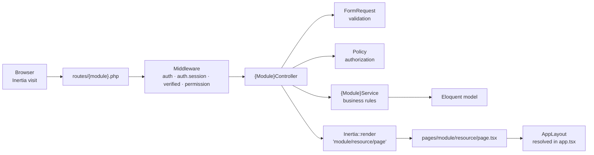

# Compozit Suite — Architecture Map

> **This file is the map of the repository.** It is the single source of truth for *where things
> live*, *what they are called*, and *which files you must touch* to add something.
>
> **Agents:** read this before planning or writing any code, and update it whenever you make a
> structural change. The sync contract lives in [`CLAUDE.md`](CLAUDE.md) and is restated in
> [§12 Keeping this file in sync](#12-keeping-this-file-in-sync). A `PostToolUse` hook enforces it.
>
> **Status:** volatile. The module list and directory layout will grow. Treat every ⬜ marker as a
> placeholder awaiting a decision, not as a settled design.

---

## 1. What this application is

Compozit Suite is a garments manufacturing ERP: buyer-scoped merchandising and production
management, built on a Laravel monolith with an Inertia + React front end. One deployable, one
database, five functional modules plus a dashboard.

---

## 2. Stack

| Layer | Technology | Version | Notes |
| --- | --- | --- | --- |
| Runtime | PHP | 8.4 (`^8.3` required) | `D:\Projects\laragon\bin\php\php-8.4.12-nts-Win32-vs17-x64` — not on the bash `PATH` |
| Framework | Laravel | `^13.17` | |
| Auth | Laravel Fortify | `^1.37` | Headless auth backend; routes registered by the package. **Login identifier is `employee_id`**, not email — see [§9.6](#96-authentication-identity) |
| RBAC | spatie/laravel-permission | `^8.3` | Published and wired, teams off — see [§9.1](#91-rbac-roles--permissions) |
| Adapter | Inertia.js (Laravel) | `^3.0` | v3 — no Axios, `Inertia::optional()` not `lazy()` |
| Typed routes | Laravel Wayfinder | `^0.1` | Generates TS from routes/controllers |
| UI | React | `19.2` | React Compiler enabled via Babel |
| Styling | Tailwind CSS + daisyUI | `4.x` / `5.x` | daisyUI supplies the theme tokens |
| Combobox | downshift | `^9.4` | Headless ARIA combobox behind `components/ui/combobox.tsx` — see [§8.5](#85-selects-are-comboboxes). The **only** third-party UI behaviour library; everything else is built on native elements + daisyUI |
| Build | Vite | `8.x` | |
| Tests | Pest | `^5.1` | |
| Static analysis | Larastan / PHPStan | `^3.9` | |
| Format | Pint (PHP), Prettier + ESLint (TS) | | |

Database: **MySQL** (`compozitsuite` on `127.0.0.1:3306` via Laragon) for local development —
`.env` sets `DB_CONNECTION=mysql`. Tests run against in-memory SQLite (`phpunit.xml`).

> This line previously said SQLite at `database/database.sqlite`; the disk disagreed, so the line
> was wrong. The split matters when writing migrations: InnoDB indexes foreign key columns
> automatically and SQLite does not, and `->change()` rebuilds the table on SQLite. Write migrations
> that are correct on both.

---

## 3. Top-level layout

```text
compozit-suite/
├── ARCHITECTURE.md          ← you are here; the repository map
├── CLAUDE.md                ← agent operating contract + sync rules + Boost guidelines
│
├── .claude/
│   ├── settings.json        Project hooks (committed)
│   └── hooks/
│       └── architecture-sync.mjs   PostToolUse hook enforcing §12
│
├── app/
│   ├── Actions/             Single-purpose invokable operations, grouped by module
│   │   └── Fortify/         Fortify's auth action contracts (not a module)
│   ├── Concerns/            Shared traits (validation rule sets, etc.)
│   ├── Console/Commands/    Artisan commands
│   ├── Enums/               Backed enums, grouped by module
│   ├── Http/
│   │   ├── Controllers/     Grouped by module
│   │   ├── Middleware/      App-wide middleware
│   │   └── Requests/        Form requests, grouped by module
│   ├── Models/              Eloquent models, grouped by module
│   ├── Observers/           Model observers — see §9.3
│   ├── Policies/            Authorization policies, grouped by module
│   ├── Providers/           Service providers
│   ├── Services/            Domain/business services, grouped by module
│   └── Support/             Framework-agnostic helpers with no module owner
│
├── bootstrap/
│   ├── app.php              Middleware stack, routing entry, exception handling
│   └── providers.php        Registered service providers
│
├── config/                  Laravel config
├── documentation/           Per-module reference docs — one `{module}.md` each; see §14
├── database/
│   ├── factories/           Grouped by module (mirrors app/Models/)
│   ├── migrations/          FLAT — chronological, never nested
│   └── seeders/             Grouped by module
│
├── resources/
│   ├── css/app.css          Tailwind + daisyUI entry
│   ├── js/
│   │   ├── actions/         GENERATED by Wayfinder — never edit
│   │   ├── routes/          GENERATED by Wayfinder — never edit
│   │   ├── components/      Grouped by module; `ui/` holds primitives
│   │   ├── hooks/           Shared React hooks
│   │   ├── layouts/         Page shells
│   │   ├── lib/             Client helpers (cn, themes)
│   │   ├── pages/           Inertia pages — path mirrors the URL
│   │   ├── types/           Shared TypeScript types
│   │   └── app.tsx          Client entry + layout resolver
│   └── views/app.blade.php  Inertia root template
│
├── routes/
│   ├── web.php              Entry point; requires every module route file
│   ├── settings.php         Module 2
│   ├── admin.php            Module 1
│   ├── merchandising.php    Module 3
│   ├── production.php       Module 4
│   ├── reports.php          Module 5
│   └── console.php          Scheduled/CLI routes
│
└── tests/
    ├── Feature/             Grouped by module — the default place to write a test
    │   └── Auth/            Fortify auth flows (not a module)
    └── Unit/                Pure logic only
```

---

## 4. The organizing rule

**Layer first, module second.**

Laravel's standard top-level directories are kept intact, and each one is subdivided by module:

```text
app/Http/Controllers/Merchandising/TechPackController.php     ✅ this
app/Modules/Merchandising/Http/TechPackController.php         ❌ not this
```

Why this and not a `app/Modules/*` package-per-module layout:

- `php artisan make:*` targets it natively (`make:controller Merchandising/TechPackController`)
  with no custom generators, autoload entries, or per-module service providers.
- Wayfinder's generated output mirrors the PSR-4 path, so
  `App\Http\Controllers\Merchandising\TechPackController` becomes
  `@/actions/App/Http/Controllers/Merchandising/TechPackController` for free.
- Laravel's factory resolver maps `App\Models\Merchandising\TechPack` →
  `Database\Factories\Merchandising\TechPackFactory` automatically.
- Cross-module reads are common in this domain (a production order reads a merchandising PO), and
  hard package boundaries would create friction with no isolation benefit in a single deployable.

**Nesting depth is one level.** `app/Models/Merchandising/TechPack.php`, not
`app/Models/Merchandising/TechPack/TechPack.php`. Sub-areas within a module (tech packs, BQS,
bookings) are expressed through *file naming*, not deeper folders. Frontend pages are the one
exception — see [§6.4](#64-frontend-pages).

---

## 5. Module registry

| # | Module | Namespace segment | Route file | Name prefix | URL prefix | Pages root | Status |
| --- | --- | --- | --- | --- | --- | --- | --- |
| 0 | Dashboard | `Dashboard` | `routes/web.php` | `dashboard` | `/dashboard` | `pages/dashboard.tsx` | ✅ built (placeholder content) |
| 1 | Admin | `Admin` | `routes/admin.php` | `admin.` | `/admin` | `pages/admin/` | 🟡 users + RBAC + designations built, rest scaffolded |
| 2 | Settings | `Settings` | `routes/settings.php` | *(see note)* | `/settings` | `pages/settings/` | ✅ partly built |
| 3 | Merchandising | `Merchandising` | `routes/merchandising.php` | `merchandising.` | `/merchandising` | `pages/merchandising/` | 🟡 scaffolded |
| 4 | Production | `Production` | `routes/production.php` | `production.` | `/production` | `pages/production/` | 🟡 scaffolded |
| 5 | Reports | `Reports` | `routes/reports.php` | `reports.` | `/reports` | `pages/reports/` | 🟡 scaffolded |

Legend: ✅ built · 🟡 directories exist, no implementation · ⬜ planned, nothing exists.

> **Settings name-prefix note:** the existing account routes (`profile.edit`, `security.edit`,
> `appearance.edit`, `user-password.update`) are unprefixed because Fortify and the starter kit
> reference them by those names. **Do not rename them.** All *new* Settings routes use the
> `settings.` prefix — e.g. `settings.master-data.colors.index`.

### Module 0 — Dashboard

Landing surface after login. KPI tiles and cross-module summaries.

| Concern | Path |
| --- | --- |
| Route | `routes/web.php` (inside the auth group) |
| Controller | `app/Http/Controllers/Dashboard/` 🟡 |
| Aggregation logic | `app/Services/Dashboard/` 🟡 |
| Page | `resources/js/pages/dashboard.tsx` ✅ |
| Widgets | `resources/js/components/shared/` |

Dashboard owns **no** models. It composes read-only data from other modules' services. If a
dashboard tile needs a query, that query belongs in the owning module's service.

### Module 1 — Admin

| Sub-area | Backend home | Pages | Status |
| --- | --- | --- | --- |
| a. User management | `Admin\UserController` | `pages/admin/users/` | ✅ |
| b. RBAC (roles & permissions) | `Admin\RoleController`, `Admin\PermissionController` | `pages/admin/roles/`, `pages/admin/permissions/` | ✅ |
| c. Buyer-wise user access control | `Admin\BuyerAccessController` | `pages/admin/buyer-access/` | 🟡 |
| d. Buyer setup & management | `Admin\BuyerController` | `pages/admin/buyers/` | 🟡 |
| e. Audit logging | `Admin\AuditLogController` | `pages/admin/audit-logs/` | 🟡 |
| f. Designations (HR job titles) | `Admin\DesignationController` | `pages/admin/designations/` | ✅ |

Models live in `app/Models/Admin/` (`Role`, `Permission`, `Designation`, `Buyer`, `AuditLog`, …). `Role` and
`Permission` extend spatie's models so RBAC data is Admin-owned like everything else — see
[§9.1](#91-rbac-roles--permissions). `User` stays at `app/Models/User.php` — it is an
authentication concern shared by the whole app, not an Admin-owned model.

Both RBAC screens follow the module's standard path: resource routes (`show` excluded) gated
per-action by `permission:` middleware, a `{Model}Service` for the write path, form requests that
enforce the name formats, and `pages/admin/{roles,permissions}/{index,create,edit}.tsx`. Shared
form pieces live in `resources/js/components/admin/`.

**User management deliberately diverges from that page pattern.** It is a *single* page —
`pages/admin/users/index.tsx` — where create, edit, role assignment, password reset, soft delete,
restore and permanent delete all happen in modals, and where the active and historical (soft-deleted)
lists are two tabs driven by a `?filter=active|trashed` query parameter rather than a second route.
It is also the module's **data-table reference**: sortable headers, gender and status filters, a
field-scoped prefix search and pagination, all carried in the query string and validated by
`UserIndexRequest` against allow-lists on the model. Copy that shape for the next list surface.
This is a decision, not drift: the owner asked for one screen. Roles and permissions keep their
`index/create/edit` pages; do not "harmonise" one into the other without a new decision.

**Designations follow the user-management shape, not the RBAC one** — one page,
`pages/admin/designations/index.tsx`, with create, edit and delete in modals. A designation is a
*descriptive* HR job title: it grants nothing, and must never appear in an authorization check
(permissions do that — [§9.1](#91-rbac-roles--permissions)). It is retired by setting its `status`
to `I`, which removes it from the user form's picker; deleting it is a real delete and is **refused
by `Admin\DesignationService::deletionBlocker()` while any user — soft-deleted ones included —
still holds it**. Note the consequence: on this screen *deactivate* and *delete* are two different
verbs, unlike `users`, where the historical tab is `deleted_at`. The reasoning behind the `status`
char is in [`documentation/admin.md`](documentation/admin.md).

Every destructive action is confirmed through `components/admin/confirm-action-dialog.tsx` (built on
the existing `components/ui/dialog.tsx` — a native `<dialog>` styled with daisyUI — not a
third-party alert library) and reports its outcome through the shared `sonner` toast.

Admin is the only module allowed to write to roles, permissions, buyer-access assignments, and
audit log records.

### Module 2 — Settings

Two distinct halves, deliberately separated:

| Half | What it holds | Backend | Pages |
| --- | --- | --- | --- |
| Account settings | The signed-in user's own profile, security, appearance | `app/Http/Controllers/Settings/` ✅ | `pages/settings/{profile,security,appearance}.tsx` ✅ |
| Master data | Product/process reference tables: colors, sizes, UOM, seasons, fabric & trim types, machine types, process stages | `app/Http/Controllers/Settings/` 🟡 | `pages/settings/master-data/` 🟡 |
| App configuration | Optional app-level toggles and defaults | 🟡 | `pages/settings/application/` 🟡 |

Master data models go in `app/Models/Settings/`. Every other module *reads* them and none of them
write them — that write path belongs to Settings alone.

**Departments are not here.** HR/org-structure reference data (designations, departments) is
Admin-owned; only product and process reference data is Settings-owned. The split and its reason
are in [§9.4](#94-master-data).

### Module 3 — Merchandising

| Sub-area | Naming | Pages |
| --- | --- | --- |
| a. Development tech pack management | `Merchandising\TechPack*` | `pages/merchandising/tech-packs/` |
| b. BQS (budget quotation sheet) | `Merchandising\Bqs*` | `pages/merchandising/bqs/` |
| b. Purchase order management | `Merchandising\PurchaseOrder*` | `pages/merchandising/purchase-orders/` |
| c. Fabric & accessory booking | `Merchandising\Booking*` | `pages/merchandising/bookings/` |

Merchandising owns the order lifecycle up to the point production begins. It is the upstream
source of truth for style, buyer order, and consumption data that Production reads.

### Module 4 — Production

Garments production: cutting, sewing, finishing, packing, and the line/output tracking around
them. Sub-areas are not yet fixed — record them here as they are decided. ⬜

Production **reads** merchandising orders and master data; it does not modify them.

### Module 5 — Reports

Read-only, cross-module reporting.

Hard rule: **reports never write domain data and never contain business rules.** A report
controller calls report services in `app/Services/Reports/`, which compose queries. If a report
needs a calculation that a module already performs, call that module's service rather than
duplicating the arithmetic.

---

## 6. Naming conventions

### 6.1 Backend classes

| Kind | Location | Example |
| --- | --- | --- |
| Controller | `app/Http/Controllers/{Module}/` | `Merchandising\TechPackController` |
| Form request | `app/Http/Requests/{Module}/` | `Merchandising\TechPackStoreRequest` |
| Model | `app/Models/{Module}/` | `Merchandising\TechPack` |
| Policy | `app/Policies/{Module}/` | `Merchandising\TechPackPolicy` |
| Service | `app/Services/{Module}/` | `Merchandising\TechPackService` |
| Action | `app/Actions/{Module}/` | `Merchandising\DuplicateTechPack` |
| Enum | `app/Enums/{Module}/` | `Merchandising\TechPackStatus` |
| Factory | `database/factories/{Module}/` | `Merchandising\TechPackFactory` |
| Seeder | `database/seeders/{Module}/` | `Settings\ColorSeeder` |
| Feature test | `tests/Feature/{Module}/` | `Merchandising/TechPackTest.php` |

Request classes are named `{Model}{Action}Request` — `TechPackStoreRequest`,
`TechPackUpdateRequest`. Actions are named as verbs — `DuplicateTechPack`, not `TechPackDuplicator`.

An index screen's request is `{Model}IndexRequest` and extends `App\Http\Requests\ListRequest`
rather than `FormRequest` — see [§8.6](#86-every-list-is-paginated-searchable-and-sortable). That
base class is the one request that lives at the root of `app/Http/Requests/`, because it belongs to
no module.

Follow the PHP conventions in `CLAUDE.md`: explicit return types, promoted constructor properties,
curly braces always, PHPDoc over inline comments, `TitleCase` enum cases.

### 6.2 Routes

- URL segments: lowercase kebab-case — `/merchandising/tech-packs/{techPack}/edit`.
- Route names: dot-delimited, `{module}.{resource}.{action}` —
  `merchandising.tech-packs.index`.
- **There is no public landing page.** `/` is named `home` but renders nothing: it redirects
  authenticated users to `dashboard` and guests to `login`. The name is retained because the auth
  layouts and Wayfinder's generated `routes/index.ts` both depend on `home()` resolving.
- Prefer resource routes; prefer `route()` and Wayfinder over hand-written URLs.
- Every module route file already applies `['auth', 'auth.session', 'verified']`. Add permission
  middleware per route or per sub-group, not globally.

### 6.3 Migrations

`database/migrations/` is **flat and chronological**. Laravel's migrator does not recurse into
subdirectories by default, so never nest them. Table names are snake_case plural and carry a
module hint where collision is plausible: `buyers`, `audit_logs`, `tech_packs`,
`purchase_orders`, `fabric_bookings`, `production_lines`.

#### Indexing

An index is not a property of a column, it is a property of a **query**. Find the query first.

- **Index what a query filters, joins or sorts on — nothing else.** An index that no `where`,
  `join` or `order by` touches is pure write cost: every insert and update maintains a B-tree that
  no select will ever read.
- **A `unique` constraint already *is* an index.** Never add a second one over the same column.
- **Don't index low-cardinality flags.** A boolean or a three-value enum is not selective enough to
  beat a scan. If such a column must be indexed, it belongs *inside a composite*, behind a
  selective leading column — never on its own.
- **Composites are ordered, and the order is the whole point.** `(deleted_at, name)` serves
  `where deleted_at … order by name`; `(name, deleted_at)` does not. Only an equality on the
  leading column lets the rest of the index supply sort order — a *range* on it (`is not null`,
  `>`, `between`) forces a filesort.
- **Foreign keys: InnoDB indexes them automatically, SQLite does not.** Development runs on MySQL
  and tests on SQLite ([§2](#2-stack)), so do not add an explicit index for a `constrained()`
  column — on MySQL it is a duplicate.
- **`LIKE '%term%'` cannot use a B-tree**, ever. The leading wildcard defeats it. Accept the scan,
  switch to prefix matching (`term%`, which an index *can* serve), or use `FULLTEXT` — and if
  `FULLTEXT`, guard the migration by driver, because Laravel's SQLite grammar has no
  `compileFullText` and the migration will throw under test.
- **`OR` across several columns defeats indexing too.** One search box matching a term against six
  columns forces an unreliable index merge, or makes the optimizer pick one index and filter the
  rest — so indexes built for the other five are never used. Prefer a **field-scoped** search (a
  "search in [column]" selector) so every query is a single-column range scan. `admin/users` is the
  worked example.
- **A `unique` index already serves `ORDER BY`,** not just lookups. With a `LIMIT`, MySQL walks it in
  order and stops early, so a `(deleted_at, that_column)` composite for sorting is usually redundant.
  Two such "obvious" composites were measured and rejected on `users`.
- **Selectivity decides whether an index gets used at all.** A prefix matching a seventh of the
  table will rightly be served by a scan; the same column with a selective prefix wins by 20×.
  Benchmark the query someone will actually run, not a broad one.
- **Verify with `EXPLAIN`; do not guess.** MySQL 8+/9 returns tree format. You want the index named
  in the plan, and `Covering index` where the query only needs indexed columns. A `Sort:` line above
  a range scan means the index is not supplying order.

Worked example, including what was deliberately *not* indexed and why:
[`documentation/admin.md` §2.1](documentation/admin.md).

### 6.4 Frontend pages

The Inertia page path **is** the file path under `resources/js/pages/`, lowercase kebab-case:

```php
Inertia::render('merchandising/tech-packs/index', [...]);
//               resources/js/pages/merchandising/tech-packs/index.tsx
```

Pages are the one place where nesting goes deeper than one level, because the path mirrors the URL.
Conventional file names within a resource directory: `index.tsx`, `create.tsx`, `edit.tsx`,
`show.tsx`.

### 6.5 Components

| Directory | Holds |
| --- | --- |
| `components/ui/` | Unstyled/low-level primitives (button, dialog, sidebar). Framework-level, no domain knowledge. |
| `components/shared/` | Cross-module composites used by two or more modules (data table, filter bar, page header). |
| `components/{module}/` | Components used by exactly one module. |

Promotion rule: a component starts in `components/{module}/`. The moment a **second** module
imports it, move it to `components/shared/` in the same change. Check for an existing component
before writing a new one.

File names are kebab-case; the exported component is PascalCase.

### 6.6 TypeScript types

Shared, app-wide types live in `resources/js/types/` and are re-exported from
`types/index.ts`. Module domain types go in `resources/js/types/{module}.ts` and must also be
re-exported there so `@/types` stays the single import path.

---

## 7. Request lifecycle



Where logic belongs, in order of preference:

1. **Form request** — validation and authorization gate.
2. **Policy** — per-record authorization.
3. **Service** — anything with more than one step, or touching more than one model.
4. **Action** — one discrete operation with a single caller.
5. **Controller** — orchestration only. A controller method that exceeds ~20 lines is a service
   waiting to be extracted.

Models hold relationships, casts, scopes, and accessors. They do not hold workflow.

---

## 8. Frontend wiring

### 8.1 Layout resolution — `resources/js/app.tsx`

Layouts are assigned centrally by page-name prefix, not per page:

| Page name matches | Layout |
| --- | --- |
| `auth/*` | `AuthLayout` |
| `settings/*` | `[AppLayout, SettingsLayout]` |
| everything else | `AppLayout` |

**New modules need no change here** — they fall through to `AppLayout`. Only edit `app.tsx` if a
module needs its own sub-layout (the way Settings does), and record that decision in this file.

### 8.2 Wayfinder — generated, never edited

`resources/js/actions/` and `resources/js/routes/` are generated by the Wayfinder Vite plugin.

- Never hand-edit them, and never hand-write a URL string in a page.
- Import controller actions from `@/actions/...` and named routes from `@/routes/...`.
- They regenerate on `npm run dev` / `npm run build`, or via `php artisan wayfinder:generate`.
- After adding routes, regenerate before writing the page that links to them.

### 8.3 Navigation

The sidebar is defined in `resources/js/components/app-sidebar.tsx`. Adding a module surface means
adding an entry there — see the checklist in [§11](#11-adding-a-new-module).

**Nav items are grouped by module.** `<NavMain>` renders one labelled group; the sidebar composes
one per module — `mainNavItems` under the default "Platform" label, `adminNavItems` under "Admin",
and so on as modules land. A module's links never join another module's group. A group whose items
are all hidden is not rendered at all.

Entries for permission-gated surfaces are appended conditionally with `useCan()` (see
[§9.1](#91-rbac-roles--permissions)), so a user never sees a link they cannot open. That is
presentation only — the route's `permission:` middleware is what actually denies access.

### 8.4 Inertia v3 notes

- **No Axios.** Use the built-in XHR client or the `useHttp` hook.
- `useHttp` owns *form state* — data, errors, `processing`. For a plain JSON **read** that has no
  form behind it (a live availability check, a typeahead), use `fetch` with an `AbortController`
  instead: `useHttp` returns a new object every render, so driving it from an effect means either
  a ref written during render or a dependency loop, both of which the React Compiler lint rules
  reject. `hooks/use-availability.ts` is the reference implementation. This is not licence to reach
  for Axios — the ban stands.
- `Inertia::optional()` — `Inertia::lazy()` / `LazyProp` are removed.
- Deferred props must render a pulsing skeleton as their empty state.
- Event renames: `invalid` → `httpException`, `exception` → `networkError`;
  `router.cancel()` → `router.cancelAll()`.

### 8.5 Selects are comboboxes

**There are no native `<select>` elements in this application.** Every one is
`components/ui/combobox.tsx`, a searchable listbox built on `downshift`.

- **One component, not two idioms.** It renders a plain listbox below
  `SEARCH_THRESHOLD` (10) options and reveals the search input above it, so a three-option Gender
  select stays one click while a long designation list is typeable. Call sites never choose.
- **It submits through a hidden `<input>`.** Every form here is an uncontrolled
  `<Form {...submit}>` reading `name=` off native elements; a `<div role="combobox">` submits
  nothing. Any new control that replaces a native form element must do the same.
- **`multiple` renders removable chips** and emits one hidden `name[]` input per selection, so the
  server sees exactly what a checkbox list would have sent.
- **Why a dependency at all**, when `dropdown-menu.tsx` deliberately replaced Radix by hand: that
  file's docblock states the rule — hand-roll the simple primitive, buy the complicated one.
  `aria-activedescendant`, roving virtual focus and filtered-result announcements are the
  complicated one. downshift is headless, so every class name is still ours.
- Placement for both is `lib/anchored-position.ts`.

#### Options endpoints — the async source

A combobox given `searchUrl` fetches its options per keystroke instead of filtering locally. Use it
when a list outgrows being shipped to the browser whole. The convention:

```php
Route::get('{resource}/options', [{Resource}Controller::class, 'options'])
    ->name('{resource}.options')
    ->middleware('permission:{module}.{resource}.view');
```

Takes `?q=`, returns `{"data": [{"value": …, "label": …, "hint": …}]}`, and **caps its result set** —
shipping fewer rows is the entire point. Match `q` as a **prefix** so the query stays indexable
([§6.3](#63-migrations)). `admin.designations.options` is the worked example; the client half is
`hooks/use-option-search.ts`, which follows `use-availability.ts` including its
`X-Requested-With` header — omit that and Laravel records the JSON URL as the session's previous
URL, sending every later `back()` to it.

### 8.6 Every list is paginated, searchable and sortable

**A list screen is never a bare `->get()`.** All four Admin lists — users, designations, roles,
permissions — go through one apparatus, and a new one inherits it rather than re-implementing it:

| Piece | Job |
| --- | --- |
| `app/Concerns/Listable` | `scopeSearch()` and `scopeSortBy()`. The model declares `SEARCHABLE` and `SORTABLE` |
| `app/Http/Requests/ListRequest` | Abstract base validating `sort` / `direction` / `search_field` / `search` / `page`. Subclasses add their own filters through `filterRules()` and `filterValues()` |
| `components/admin/list-toolbar.tsx` | The filter bar — dropdown filters plus a field-scoped search |
| `components/admin/sortable-header.tsx` | Clickable `<th>`, and `nextSort()` |
| `components/admin/pagination.tsx` | "Showing x–y of z" with prev/next |

Rules that come with it:

- **The allow-lists are a security control, not a convenience.** Request input reaching `orderBy()`
  is a SQL injection. It is validated in the request *and* clamped in the scope; keep both.
- **Search is a prefix match on one named field.** Never an `OR` across columns — see
  [§6.3](#63-migrations). The toolbar's "Search in" selector is what makes the per-column indexes pay.
- **Paginate with `->paginate()->withQueryString()->through(…)`.** Without `withQueryString`, page 2
  silently drops the sort and filters.
- **`SORTABLE` holds columns, not aggregates.** Sorting by a `withCount` alias needs a different
  path; `Role::SORTABLE` records why `users_count` is absent.
- **A list and its picker are different queries.** Paginating a list must never paginate the
  dropdown that offers the same records elsewhere —
  `DesignationService::assignableOptions()` and `PermissionService::groupedByModule()` are both
  deliberately unpaginated, and both have a test pinning it.
- **Grouped rendering and pagination are incompatible.** A group gets cut across a page boundary.
  The permissions list traded its module grouping for a Module column and filter; if a future list
  wants grouping, it does not get pagination, and that trade must be recorded.

`ListRequest` sits at the root of `app/Http/Requests/` rather than a module folder, because it
belongs to no module — a deliberate exception to [§6.1](#61-backend-classes).

The contract is tested once for every surface in `tests/Feature/Admin/ListBehaviourTest.php`. **Add
a new list to its `surfaces()` dataset** and it inherits the whole set.

---

## 9. Cross-cutting concerns

### 9.1 RBAC (roles & permissions)

`spatie/laravel-permission ^8.3` is **installed and wired**. The shape:

| Piece | Where |
| --- | --- |
| Config | `config/permission.php` — published, pointed at the app's own models |
| Tables | `database/migrations/2026_08_26_065123_create_permission_tables.php` (teams **off**) |
| Models | `App\Models\Admin\Role` / `App\Models\Admin\Permission`, each extending the spatie model |
| User trait | `App\Models\User` uses `Spatie\Permission\Traits\HasRoles` |
| Middleware aliases | `bootstrap/app.php` → `role`, `permission`, `role_or_permission` |
| Super-admin bypass | `AppServiceProvider::configureAuthorization()` — `Gate::before` for `Role::SUPER_ADMIN` |
| Catalogue + seeding | `Database\Seeders\Admin\RolePermissionSeeder`, run from `DatabaseSeeder` |
| Admin UI | `Admin\RoleController`, `Admin\PermissionController` → `pages/admin/{roles,permissions}/` |

Rules:

- Permission names read `{module}.{resource}.{action}` — `merchandising.tech-packs.update`. The
  format is enforced by `RoleStoreRequest`/`PermissionStoreRequest` validation.
- Roles are data, not code. Never hardcode a role name in a check; check the permission. The one
  exception is `Role::SUPER_ADMIN` (`super-admin`), which exists only so the `Gate::before` bypass
  and the "you may not edit this role" guards have something to name.
- Route-level gating uses spatie's `permission:` middleware; record-level gating uses the module's
  policy in `app/Policies/{Module}/`.
- **A guard that must also bind a super admin does not belong in a policy.** `Gate::before` grants a
  super admin every ability, so a policy denial is bypassed for exactly the account the guard is
  usually protecting against. Such rules live in the module's service — see
  `Admin\UserService::roleAssignmentBlocker()` / `deletionBlocker()`, which stop a user editing their
  own roles, deleting their own account from Admin, or removing the last super admin — or in the form
  request, as `Concerns\RoleAssignmentRules::assignableRoleRule()` does for granting `super-admin`.
  `Admin\RoleController`'s super-admin guard is the original instance of this pattern.
- User administration is gated by eight permissions: `admin.users.` `view`, `create`, `update`,
  `delete` (soft delete), `restore`, `force-delete` (permanent), `reset-password` and `assign-roles`.
  `assign-roles` is separate from `update` on purpose, so editing a profile does not imply the power
  to widen someone's access.
- **Teams are deliberately off.** Buyer scoping ([§9.2](#92-buyer-scoped-access-control)) is
  row-level data filtering, not per-team roles; spatie's teams feature does not solve it and would
  add a `team_id` to every pivot for nothing.
- `HandleInertiaRequests` shares `auth.permissions` (a flat array of the signed-in user's effective
  permission names, `['*']` for a super admin) so the front end can hide surfaces the user cannot
  reach. Use the `useCan()` hook in `resources/js/hooks/use-can.ts`, never a role-name check.
  Hiding a link is **not** authorization — the route middleware and policy are.

### 9.2 Buyer-scoped access control

A user is granted access to a set of buyers, and every buyer-owned record must be filtered by that
set. This is a **data-scoping** concern that is separate from RBAC: a permission says *what* a user
may do, buyer scope says *which rows* they may do it to.

The mechanism is not yet chosen. ⬜ Record the decision here when it is made — the candidates are a
global scope on buyer-owned models, or an explicit query scope applied in services. Whichever is
chosen must be applied uniformly, because a single unscoped query is a data leak across buyers.

### 9.3 Audit logging

Every mutation to a buyer-owned or administrative record is auditable. The general mechanism — what
gets written to `audit_logs`, and by what — is still undecided. ⬜

**Actor stamping is decided and built.** `app/Observers/` holds a single `ActorObserver`, which sets
`inserted_by` on create and `last_updated_by` on update from `Auth::id()` for **every** model that
carries those two columns — currently `User` and `Admin\Designation`. Both columns are nullable
foreign keys to `users.id` with `nullOnDelete`, and both stay null for writes with no authenticated
actor (seeders, migrations, console). Neither is mass-assignable on any stamped model — the observer
is the only writer, so every write path is stamped identically.

It is *one shared observer typed against `Model`*, not one per model. That was previously
`UserObserver`, renamed and generalised when `designations` became the second stamped table: the
guarantee above ("every write path is stamped identically") is exactly what a second hand-copied
observer stops being able to make. A model opts in by carrying the two columns and the attribute —
there is nothing else to write.

Observers are registered with the `#[ObservedBy]` attribute on the model, not in a service provider.
When the full audit-log mechanism is chosen, it belongs here alongside this.

### 9.4 Master data

Reference master data by foreign key, never by copying its label into another table.

**Ownership splits in two, by subject matter:**

| Kind | Owner | Examples | Models | Seeders |
| --- | --- | --- | --- | --- |
| **Product / process** reference data | Settings | colors, sizes, UOM, seasons, fabric & trim types, machine types, process stages | `app/Models/Settings/` | `database/seeders/Settings/` |
| **HR / org-structure** reference data | Admin | designations ✅, departments | `app/Models/Admin/` | `database/seeders/Admin/` |

Everyone else *reads* both and writes neither.

> This section previously said master data was Settings-owned without exception, and listed
> departments among the Settings tables. The owner decided otherwise when `designations` was built:
> HR reference data is administered next to the users who hold it, on the same screen family and
> behind the same `admin.*` permissions, not on a Settings page beside colors and sizes. The split
> is by *subject*, not by table shape — the test is "does an Admin administering people need this?"
> **Departments move to Admin when they are built**; the §5 Module 2 row still lists them and is
> the line to correct at that point.

### 9.5 Shared props

`app/Http/Middleware/HandleInertiaRequests.php` shares `name`, `auth.user`, `sidebarOpen`, and
`theme` with every page. Anything added there is paid for on **every** request — prefer per-page
props, and use `Inertia::optional()` for anything expensive.

### 9.6 Authentication identity

**Users log in with `employee_id`, not email.** `config/fortify.php` sets
`'username' => 'employee_id'`, so the login form posts `employee_id` and the login rate limiter keys
on it automatically.

- `lowercase_usernames` is **`false`**. Employee IDs may contain uppercase letters
  (`/^[A-Za-z0-9-]{3,10}$/`) and are stored exactly as HR issued them; lowercasing the submitted
  value would make any uppercase ID impossible to log in with. Matching is therefore case-sensitive.
- **Password reset stays keyed on `email`** (`config('fortify.email')`). Laravel's password broker
  and the `password_reset_tokens` table are both email-keyed, and the link has to be emailed
  regardless — so the forgot-password form still asks for the email address. `email` remains required
  and unique on `users`.
- `users` uses `SoftDeletes`, so a deleted user cannot authenticate: the default user provider
  applies the global scope. Their `employee_id` and `email` stay reserved by the unique indexes,
  which is intentional — reusing one is refused with a message pointing at the Historical tab.

---

## 10. Adding a feature to an existing module

The end-to-end path, in order:

1. **Migration** — `php artisan make:migration create_tech_packs_table` (stays flat).
2. **Model** — `php artisan make:model Merchandising/TechPack -f` (`-f` puts the factory in
   `database/factories/Merchandising/` automatically).
3. **Policy** — `php artisan make:policy Merchandising/TechPackPolicy --model=Merchandising/TechPack`.
4. **Form requests** — `php artisan make:request Merchandising/TechPackStoreRequest`.
5. **Service** — `php artisan make:class Services/Merchandising/TechPackService` if the operation
   is multi-step.
6. **Controller** — `php artisan make:controller Merchandising/TechPackController --resource`.
7. **Routes** — add to `routes/merchandising.php` inside the existing prefixed group.
8. **Regenerate Wayfinder** — `php artisan wayfinder:generate` (or just run the dev server).
9. **Pages** — `resources/js/pages/merchandising/tech-packs/{index,create,edit}.tsx`.
10. **Test** — `php artisan make:test --pest Merchandising/TechPackTest`, then
    `php artisan test --compact --filter=TechPack`.
11. **Format** — `vendor/bin/pint --dirty --format agent` and `npm run format`.
12. **Update this file** if the change was structural.

Pass `--no-interaction` to every `make:` command.

---

## 11. Adding a new module

A module is not "added" until every one of these is done:

- [ ] `routes/{module}.php` created with the prefixed group, and `require`d from `routes/web.php`.
- [ ] `app/Http/Controllers/{Module}/` created.
- [ ] `app/Http/Requests/{Module}/`, `app/Models/{Module}/`, `app/Policies/{Module}/`,
      `app/Services/{Module}/` created as the module needs them.
- [ ] `database/factories/{Module}/` and `database/seeders/{Module}/` created.
- [ ] `resources/js/pages/{module}/` created.
- [ ] `resources/js/components/{module}/` created.
- [ ] `tests/Feature/{Module}/` created.
- [ ] Sidebar group added to `resources/js/components/app-sidebar.tsx` — a `{module}NavItems` array
      rendered as its own `<NavMain items={…} label="{Module}" />` (see [§8.3](#83-navigation)).
- [ ] Permission names for the module decided and seeded.
- [ ] **A row added to the module registry in [§5](#5-module-registry) of this file, plus a
      per-module section.**

---

## 12. Keeping this file in sync

This file is worthless the moment it drifts. It is **volatile by design** — the layout it describes
is expected to change as the project's needs become clearer.

**Update `ARCHITECTURE.md` in the same change** that does any of the following:

| Trigger | What to update |
| --- | --- |
| A module is added, renamed, removed, or re-scoped | [§5](#5-module-registry) registry + section |
| A top-level or module-level directory is created or removed | [§3](#3-top-level-layout) tree |
| A route file is added or its prefix changes | [§5](#5-module-registry) registry |
| A naming convention is established or changed | [§6](#6-naming-conventions) |
| A cross-cutting mechanism is chosen (RBAC wiring, buyer scoping, audit logging) | [§9](#9-cross-cutting-concerns) — replace the ⬜ with the decision *and its rationale* |
| A dependency that shapes the architecture is added or upgraded | [§2](#2-stack) |
| `app.tsx` layout resolution changes | [§8.1](#81-layout-resolution--resourcesjsapptsx) |
| A status marker becomes true (🟡 → ✅) | the relevant table |
| A module's surfaces change in a way its reference doc describes | `documentation/{module}.md` — see [§14](#14-module-reference-documentation) |
| A table is created, or a query pattern against one changes | Nothing here — but apply [§6.3 Indexing](#63-migrations) and record the `EXPLAIN` reasoning in the module's doc |

**Do not** update it for ordinary feature work that follows the existing conventions — a new
controller inside an existing module is not a structural change.

This is machine-enforced. `.claude/hooks/architecture-sync.mjs` runs on every Write/Edit and pushes
back when a structural file (`routes/*.php`, `resources/js/app.tsx`, `composer.json`,
`package.json`, `bootstrap/*.php`) is touched while this file has no pending edits, or when a file
is written into a module directory whose name appears nowhere below. Both checks are self-clearing.
The hook is a backstop, not a substitute — it cannot see a renamed convention or a resolved ⬜.

When a decision recorded here turns out to be wrong, **change the decision in place and say why**.
Do not append a contradicting note that leaves both readings live.

---

## 13. Commands

```bash
# Run everything (server :8000 + queue + vite) — the app is only live while this runs
composer run dev

# Tests
php artisan test --compact
php artisan test --compact --filter=TechPack

# Seed the RBAC catalogue (idempotent — re-run after adding permissions)
php artisan db:seed --class="Database\Seeders\Admin\RolePermissionSeeder"

# Quality gate (lint + types + tests)
composer run ci:check

# Format
vendor/bin/pint --dirty --format agent   # PHP — required before finalizing PHP changes
npm run format                           # TS/TSX
npm run types:check                      # tsc --noEmit

# Discovery
php artisan route:list --except-vendor
php artisan route:list --path=merchandising
php artisan wayfinder:generate
```

Local URL is **http://localhost:8000** (port 8080 is the Laragon landing page, not this app).
PHP is not on the bash `PATH`; invoke it via
`D:\Projects\laragon\bin\php\php-8.4.12-nts-Win32-vs17-x64\php.exe` or use PowerShell.

---

## 14. Module reference documentation

`documentation/` holds one `{module}.md` per module — currently
[`documentation/admin.md`](documentation/admin.md).

**These files and this one do different jobs. Do not let them overlap.**

| | `ARCHITECTURE.md` | `documentation/{module}.md` |
| --- | --- | --- |
| Answers | *Where* does this go, *what* is it called | *What* does this surface do, and *why* is it built this way |
| Scope | The whole repository | One module |
| Read it | Before planning or writing any code | When working inside that module |

When the two would say the same thing, the module doc **links to the section here** rather than
restating it. Two copies of a decision means one of them is silently wrong later.

A module doc is updated in the same change as the module surface it describes — the same standing
obligation as [§12](#12-keeping-this-file-in-sync), though the `PostToolUse` hook does not check it.
